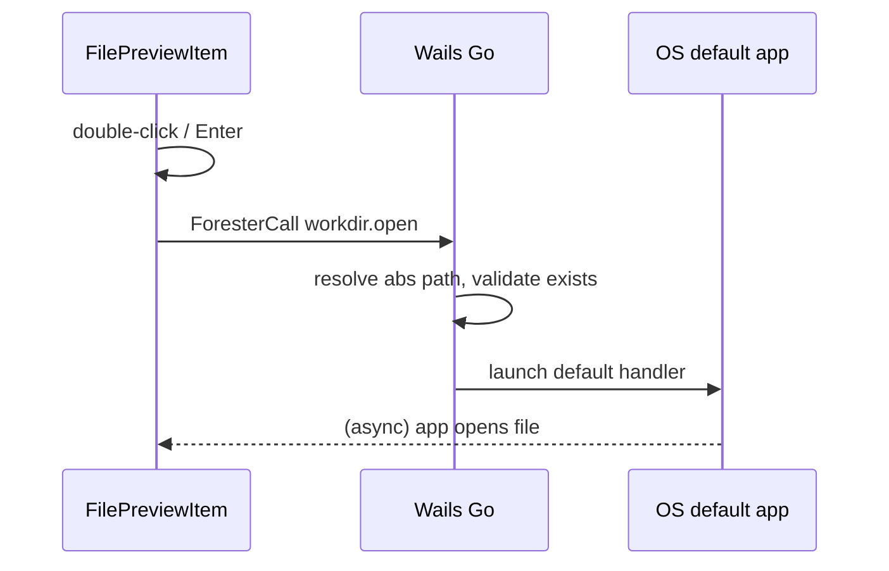

# Content Preview — Project view (просмотр содержимого папки)

Панель **Content Preview** в режиме **Project view**: сетка папок и файлов выбранной в Sidebar рабочей категории (папки).

**Figma (shadcn kit):**
- [Content Preview](https://www.figma.com/design/Vhp8g306WGBcjSzL4lnl23/?node-id=4026-4988)
- [Folder Item](https://www.figma.com/design/Vhp8g306WGBcjSzL4lnl23/?node-id=4026-5059)
- [File Item](https://www.figma.com/design/Vhp8g306WGBcjSzL4lnl23/?node-id=4026-5023)

**Цвета:** [design-tokens.md](./design-tokens.md)

**Стек:** Wails (Go backend) + React + shadcn/ui

**Связанные документы:** [architecture.md](./architecture.md) · [sidebar-project-view.md](./sidebar-project-view.md) · [folder-preview-item.md](./folder-preview-item.md) · [file-preview-item.md](./file-preview-item.md) · [content-info-project-view.md](./content-info-project-view.md)

---

## 1. Назначение и связь с Sidebar

Content Preview работает **в связке с Sidebar (Project view)**. Когда в дереве Sidebar выбрана папка рабочей категории, Preview показывает её содержимое в виде сетки:

| Секция | Содержимое |
|--------|------------|
| **Folders** | Immediate subfolders выбранной папки (`FolderItem`) |
| **Files (`<folder>`)** | Immediate files выбранной папки (`FilePreviewItem`) |

Источник входа: `onProjectViewContextChange({ selectedFolderPath, showChangedOnly })` (см. [architecture.md §3.1](./architecture.md), [sidebar-project-view.md §3.3](./sidebar-project-view.md)).

### 1.1 Зафиксированные решения

| # | Тема | Решение |
|---|------|---------|
| 1 | Навигация | **Drill-down в Preview + двусторонняя синхронизация**: клик по подпапке открывает её в Preview **и** выделяет узел в дереве Sidebar |
| 2 | Кнопки `<` `>` | **История навигации** (back/forward) по посещённым папкам внутри Preview |
| 3 | Сортировка | **Переключатель En-us / A-я** в toolbar (`ArrowUpDown`); Folders и Files сортируются независимо (см. §6) |
| 4 | Мультиселект | **Только файлы**. Папки — одиночный выбор; double-click для входа |
| 5 | Поиск | **По всему репозиторию** (global search), результаты в отдельном results view (§7) |
| 6 | Changed ON | Секция **Folders скрывается**; flat-список **всех committable** в поддереве выбранной папки (§8) |
| 7 | Слайдер | Масштаб миниатюр **48px → 128px**, шаг **18px** (§5) |
| 8 | Double-click файл | **Открыть в связанном приложении ОС** (default handler) через Wails (§4.4) |

---

## 2. Анатомия UI

```
┌──────────────────────────────────────────────────────────────┐
│ [<] [>] │ Title (breadcrumbs)   [——●——— slider]   [🔍 Search ] │  Toolbar
├──────────────────────────────────────────────────────────────┤
│ Folders                                                        │
│ ┌────────┐ ┌────────┐ ┌────────┐ ┌────────┐                   │
│ │ 📁     │ │ 📁     │ │ 📁     │ │ 📁     │   (wrap grid)      │
│ │Refs    │ │Textures│ │Models  │ │Scenes  │                   │
│ │5 Files │ │12 Files│ │3 Files │ │8 Files │                   │
│ └────────┘ └────────┘ └────────┘ └────────┘                   │
│                                                                │
│ Files (References)                                             │
│ ┌────────┐ ┌────────┐ ┌────────┐ ┌────────┐                   │
│ │ ▦      │ │ ▦      │ │ ▦      │ │ ▦      │                   │
│ │(status)│ │        │ │(status)│ │        │                   │
│ │file.png│ │a.fbx   │ │b.png   │ │c.obj   │                   │
│ └────────┘ └────────┘ └────────┘ └────────┘                   │
└──────────────────────────────────────────────────────────────┘
```

### 2.1 Toolbar (node `7310:15989`)

`flex items-center gap-1`, `px-2 py-1.5`, нижняя граница `Separator`.

| # | Элемент | Spec | Поведение |
|---|---------|------|-----------|
| 1 | **Back** `<` | `Button` ghost 40×40, `ChevronLeft` 16 | Назад по истории навигации (§4) |
| 2 | **Forward** `>` | `Button` ghost 40×40, `ChevronRight` 16 | Вперёд по истории навигации (§4) |
| — | Separator | vertical, 24px | разделитель групп |
| 3 | **Breadcrumbs / Title** | `text-lg/regular` 18px, `flex-1`, truncate | путь текущей папки; клик по сегменту → переход (§4.3) |
| 4 | **Slider** | `120px`, shadcn `Slider` sm | масштаб миниатюр (§5) |
| 5 | **Search** | `Input` 250px, `Search` icon 20, placeholder `Search` | global search (§7) |
| 6 | **Sort** | `Button` ghost, `ArrowUpDown` 16 | toggle `En-us` ↔ `A-я` (§6) |

### 2.2 Секция Folders (node `7310:16002`)

- Header `Folders` — `h4` (Inter Semi Bold 20, tracking −0.5).
- Сетка `FolderItem`, gap `8px`, wrap.
- Скрывается полностью, если у папки нет подпапок **или** при Changed ON (§8).

### 2.3 Секция Files (node `7310:16010`)

- Header `Files (<folderName>)` — `h4`; имя текущей папки в скобках.
- Сетка `FilePreviewItem`, gap `8px`, wrap.
- Корень репо: header `Files` без скобок (или `Files (root)`).

### 2.4 Сетка (layout)

- Direction: `flex-row flex-wrap` (или CSS grid `auto-fill`), gap `8px`.
- Размер ячейки = текущий масштаб слайдера (§5).
- Контейнер контента: `flex-col gap-6`, `px-4 py-3`, вертикальный скролл (`ScrollArea`).

### 2.5 shadcn/ui mapping

| UI | shadcn |
|----|--------|
| Back/Forward | `Button` variant `ghost` |
| Breadcrumbs | `Breadcrumb` |
| Slider | `Slider` |
| Search | `Input` |
| Folder / File item | custom + `Badge` (status) + `Tooltip` (truncated name) |
| Scroll | `ScrollArea` |
| Loading | `Skeleton` |
| Marquee selection | custom overlay (§9) |

---

## 3. Item: состояния и спецификация

Полные спеки компонентов — в отдельных документах:

- [folder-preview-item.md](./folder-preview-item.md) — Default / Hover / Selected
- [file-preview-item.md](./file-preview-item.md) — Default / Hover / Selected × Min / Max + status badge

### 3.1 Folder Item (кратко)

**Figma:** [node 7310:16074](https://www.figma.com/design/GTu6s7FMr4Tn1NWrYeGpIF/?node-id=7310-16074)

| Состояние | Background | Border | Node |
|-----------|-----------|--------|------|
| **Default** | прозрачный | нет | — |
| **Hover** | `bg-accent` | нет, `rounded-md` | — |
| **Selected** | `bg-accent` | `border-ring`, `rounded-md` | — |

Токены: [design-tokens.md §4](./design-tokens.md) — `itemStateClasses`.

> Папка **не мультиселектится**. Selected — подсветка при single-click; drill-down — double-click (§4).

#### Жесты на папке

| Жест | Действие |
|------|----------|
| **Single click** | Подсветка `Selected`; **не** входит внутрь |
| **Double click** | Drill-down + sync Sidebar (§4) |
| **Enter** (с фокуса) | = double click |

### 3.2 File Item (кратко)

**Figma:** [node 7310:16038](https://www.figma.com/design/GTu6s7FMr4Tn1NWrYeGpIF/?node-id=7310-16038)

| Состояние | Min node | Max node |
|-----------|----------|----------|
| **Default** | `7310:16039` | `7310:16044` |
| **Hover** | `7310:16049` | `7310:16054` |
| **Selected** | `7310:16059` | `7310:16064` |

Thumbnail: **48×48** (Min) → **128×128** (Max). Status badge — VCS-коды (§3.3); lock badge — §3.3.1.

#### Жесты на файле

| Жест | Действие |
|------|----------|
| **Single click** | Заменить selection; emit `PreviewSelection` |
| **Ctrl/Cmd + click** | Тоггл в мультиселекте (§9) |
| **Shift + click** | Диапазон от anchor (§9) |
| **Marquee** | Рамка по секции Files (§9.3) |
| **Double click** | Открыть файл в **приложении по умолчанию ОС** (§4.4) |
| **Enter** (с фокуса) | = double click (открытие через ОС) |

### 3.3 Status Badge: коды

| Код | `VcsFileStatus` | Источник (`status.get`) | Tooltip |
|-----|-----------------|--------------------------|---------|
| `A` | `staged-new` | `staged_new_files` | Added (staged) |
| `M` | `staged-modified` | `staged_modified_files` | Modified (staged) |
| `D` | `staged-deleted` | `staged_deleted_files` | Deleted (staged) |
| `M` | `modified` | `unstaged_modified_files` | Modified |
| `D` | `deleted` | `unstaged_deleted_files` | Deleted |
| `N` | `untracked` | `untracked_files` | Untracked |

> Если файл одновременно staged и unstaged-modified — приоритет staged (показываем `M` staged). Tooltip на badge через `title` / `Tooltip`.

Цвета VCS: `vcsStatusBadgeClass` — [design-tokens.md §3.5](./design-tokens.md). Рендер: `<span>`, не `Badge variant="default"`.

### 3.3.1 Lock badge

| Поле | Значение |
|------|----------|
| Источник | `lock.list` → `lockedByPath` в project store |
| Текст | `lock` |
| Tooltip | `Locked by {user}` |
| Видимость | Только для заблокированных файлов |
| Позиция | По центру снизу thumbnail в группе с VCS badge |
| Расстояние | `gap-1` (4px) между VCS и lock badge |

Обновление: при `loadProjectData` и в polling вместе с `status.get` ([file-preview-item.md §2.3](./file-preview-item.md)).

### 3.4 Сводная матрица состояний item

| Тип | Default | Hover | Selected | Multi-selected | Status badge | Lock badge |
|-----|---------|-------|----------|----------------|--------------|------------|
| Folder | ✓ | ✓ | ✓ (1 шт.) | ✗ | ✗ | ✗ |
| File | ✓ | ✓ | ✓ | ✓ (Shift/Ctrl/рамка) | ✓ (если не clean) | ✓ (если в `lock.list`) |

Стили Selected и Multi-selected: `bg-accent border-ring` ([design-tokens.md](./design-tokens.md)).

---

## 4. Навигация по папкам (drill-down + sync)

### 4.1 Модель

- Текущая папка Preview = `previewFolderPath`.
- Источники изменения `previewFolderPath`:
  1. Выбор папки в дереве Sidebar (`onProjectViewContextChange`).
  2. Double-click по `FolderItem` в Preview.
  3. Back/Forward кнопки.
  4. Клик по сегменту breadcrumbs.
- При **любом** изменении `previewFolderPath` → **`PreviewSelection = { kind: 'none' }`** ([api-contract.md §6](./api-contract.md)).
- При изменении из Preview (пп. 2–4): синхронизировать выделение узла в дереве Sidebar (scroll-to + highlight).

### 4.2 История навигации (back/forward)

```ts
interface NavHistory {
  stack: string[]   // посещённые папки
  index: number     // указатель текущей
}
```

- Drill-down / выбор папки → `push` (обрезает forward-хвост).
- `<` Back → `index--`; `>` Forward → `index++`.
- Кнопки `disabled`, когда нет цели (`index===0` / `index===stack.length-1`).
- Синхронизация Sidebar при back/forward тоже срабатывает.
- Изменение папки **из Sidebar** также добавляется в стек (единая история).

### 4.3 Breadcrumbs

- Сегменты пути от repo root до текущей папки.
- Клик по сегменту → переход на эту папку (push в историю + sync Sidebar).
- Длинный путь: middle-truncation (`Repo / … / parent / current`) с overflow-меню.

### 4.4 Открытие файла (double-click → приложение ОС)

**Double-click** по `FilePreviewItem` (и **Enter** при фокусе на файле) открывает файл в **приложении по умолчанию**, назначенном ОС для данного типа (MIME / extension binding).

| Платформа | Механизм (Go backend) |
|-----------|------------------------|
| **macOS** | `open <absPath>` |
| **Windows** | `ShellExecute` / `start` с ассоциированным handler |
| **Linux** | `xdg-open <absPath>` |

#### Flow



#### Правила

- Открывается **ровно один** файл — тот, по которому сделан double-click (даже при активном multiselect).
- Пути: [paths.md §6–§7](./paths.md) — `Join(repoRoot, FromSlash(fileRel))`, native abs для ОС.
- **Не** открывать встроенный preview/diff Forester — только делегирование ОС (Content Info / diff — отдельные действия).
- При успехе: без модального UI; опционально toast «Opened in …» (v1.1).
- Selection **не сбрасывается** после открытия.

#### JSON API

`workdir.open` — [api-contract.md §2.3](./api-contract.md). `EvalSymlinks` перед launch — [paths.md §3](./paths.md).

```ts
async function onFileDoubleClick(filePath: string) {
  try {
    await foresterCall(repoPath, 'workdir.open', { path: filePath })
  } catch (e) {
    toast.error(formatOpenError(e)) // e.g. "No application found for .blend"
  }
}
```

#### Corner cases (открытие)

| Ситуация | Поведение |
|----------|-----------|
| Файл удалён с диска (`deleted` / `staged-deleted`) | Toast «File not found»; не вызывать ОС |
| Нет ассоциированного приложения | Toast с текстом ошибки ОС |
| Нет прав на чтение | Toast «Permission denied» |
| Симлинк | `EvalSymlinks` перед open — [paths.md §3](./paths.md); broken → toast |
| Путь вне repo (path traversal) | Backend reject до вызова ОС |
| Double-click во время marquee-drag | Игнорировать |
| Результаты поиска | То же поведение — открыть файл по `path` |
| Binary / huge file | ОС решает; Forester не блокирует по размеру |

---

## 4.5 Context menu (right-click на файле)

Канон: [file-preview-item.md §4.2](./file-preview-item.md).

| Item | API / поведение |
|------|-----------------|
| Copy | Clipboard: repo-relative path |
| Rename | Dialog → `workdir.rename` |
| Edit in: | Submenu → `workdir.open { editor }`; список из `appStore.externalEditorPaths` |
| Delete | Confirm → `workdir.delete` (OS Trash / Recycle Bin) |

Список редакторов обновляется сразу при изменении в Settings (вкладка External editors). Blender включается в submenu, если задан `[blender].path`.

---

## 5. Слайдер масштаба миниатюр

Управляет размером ячеек обеих секций (Folders + Files) одновременно.

| Параметр | Значение |
|----------|----------|
| Min (thumbnail) | **48×48** (`Preview size=Min`) |
| Max (thumbnail) | **128×128** (`Preview size=Max`) |
| **Шаг** | **18px** (дискретные позиции) |
| Default | Min (48) |

### 5.1 Дискретные позиции слайдера

Шаг слайдера — **18px**. Допустимые значения (px):

```
48 → 66 → 84 → 102 → 120 → 128
```

| Index | px | Визуал thumbnail |
|-------|-----|------------------|
| 0 | **48** | Min |
| 1 | **66** | Min |
| 2 | **84** | Min |
| 3 | **102** | Max |
| 4 | **120** | Max |
| 5 | **128** | Max |

- Позиции `48`, `66`, `84` — **Min-визуал**: плоский квадрат с бордером `border/default`, VCS/lock badges по центру снизу (`-bottom-1`, `gap-1`).
- Позиции `102`, `120`, `128` — **Max-визуал**: dot-grid placeholder, VCS/lock badges по центру снизу (`bottom-0`, `gap-1`).
- Порог переключения Min↔Max: **`>= 102px`**.
- Значение `128` — явный endpoint (не кратен шагу 18 от 120; последний тик слайдера).

```ts
const THUMB_SCALE_STEPS = [48, 66, 84, 102, 120, 128] as const
const THUMB_SCALE_STEP_PX = 18

function isMaxVisual(px: number): boolean {
  return px >= 102
}
```

- Слайдер влияет на `FolderPreviewItem` (иконка масштабируется пропорционально) и `FilePreviewItem`.
- Персистентность: per-repo `localStorage` `dfm.preview.thumbScale` (хранить px: `48`…`128`).
- Имя файла/папки всегда `truncate` + `Tooltip` на полное имя.

---

## 6. Сортировка (En-us / A-я)

**Переключатель в toolbar** — иконка `ArrowUpDown`; tooltip показывает активный режим.

| Режим | `Intl.Collator` locale | Label в UI |
|-------|------------------------|------------|
| **En-us** | `en-US` | `A–Z` / `En-us` |
| **A-я** | `ru` | `А–Я` / `A-я` |

```ts
const collator = new Intl.Collator(sortLocale, {
  numeric: true,
  sensitivity: 'base',
})
```

- Folders и Files сортируются **независимо**, по возрастанию.
- Persist per-repo: `localStorage` `dfm.preview.sortLocale` → `'en-US'` | `'ru'`.
- При смене сортировки selection файлов сохраняется **по path**; `anchorPath` пересчитывается.
- Смешанные алфавиты: упорядочение по правилам выбранной locale (ограничение `Intl` — v2: ICU root).

---

## 7. Поиск (global, по всему репозиторию)

Поле Search в toolbar ищет по **всему репозиторию**, не только в текущей папке.

### 7.1 Поведение

- Ввод (debounce ~200мс) → переход в **results view** вместо обычной folder-сетки.
- Очистка поля / `Esc` → возврат к содержимому `previewFolderPath`.
- Match: substring по имени (case-insensitive, locale-aware), по папкам **и** файлам.
- Backend: `workdir.search` (§10) — обход дерева с учётом `.dfmignore` / `.DFM`.

### 7.2 Results view

```
┌──────────────────────────────────────────┐
│ Search results for "tex"  (24)    [Clear] │
├──────────────────────────────────────────┤
│ Folders (3)                               │
│ [📁 Textures]  [📁 tex_src] …             │
│ Files (21)                                │
│ [▦ texture01.png] [▦ tex_a.fbx] …         │
└──────────────────────────────────────────┘
```

- Те же `FolderItem` / `FilePreviewItem`, сгруппированы Folders / Files.
- Под каждым item — относительный путь (`text-xs muted`), чтобы различать одноимённые.
- Клик по папке в результатах → drill-down туда (выход из поиска + sync Sidebar).
- Клик по файлу → выбор файла; **double-click → открыть в приложении ОС** (§4.4).
- Сортировка результатов — та же locale-сортировка (§6); внутри групп.
- При Changed ON поиск ограничен committable-файлами (см. §8).

### 7.3 Состояния поиска

| Состояние | UI |
|-----------|-----|
| Печать (loading) | Skeleton-сетка + спиннер в поле |
| Нет совпадений | Empty state «No results for "<q>"» |
| Очень много (>N) | Виртуализация + счётчик «Showing first N» |

---

## 8. Режим Changed (Switch ON в Sidebar)

Сигнал `showChangedOnly` приходит из Sidebar (`onProjectViewContextChange`).

| Аспект | Changed OFF | Changed ON |
|--------|-------------|------------|
| Секция **Folders** | Все immediate subfolders | **Скрыта целиком** (решение §1.1 #6) |
| Секция **Files** | Все immediate files | **Все committable** в поддереве `selectedFolderPath` (рекурсивно) |
| Header Files | `Files (<folder>)` | `Changed files (N)` |
| Карточка файла | имя | имя + subtitle parent folder |
| Сортировка Files | по `name` | по полному `path` |
| Поиск | по всему репо | по committable-файлам всего репо |

Фильтр committable — см. [sidebar-project-view.md §3.2–3.3](./sidebar-project-view.md) (`committableFilesInSubtree`).

При Changed ON и отсутствии committable-файлов в scope → empty state «No changed files».

**Типичный UX:** toggle ON + root в Sidebar → все изменённые файлы репо в одной сетке → multiselect → **Create commit** в Content Info.

---

## 9. Мультиселект (только файлы)

Папки исключены из мультиселекта (§1.1 #4). Всё ниже относится к `FilePreviewItem`.

### 9.1 Модель selection

```ts
interface PreviewSelectionState {
  selectedFilePaths: Set<string>
  anchorPath: string | null     // для Shift-диапазона
  activePath: string | null     // последний clicked (фокус)
}
```

### 9.2 Жесты

| Жест | Поведение |
|------|-----------|
| **Click** | `selected = {path}`, `anchor = path`, `active = path`; emit `{ kind: 'files', paths: [path], primary: path }` |
| **Ctrl/Cmd + click** | Тоггл `path` в set; `anchor = path` |
| **Shift + click** | Выделить диапазон `[anchor … path]` в текущем порядке сортировки; заменяет set (без Ctrl) |
| **Ctrl + Shift + click** | Добавить диапазон к существующему set |
| **Рамка (marquee)** | Drag по пустому месту → выделить файлы, пересекающие прямоугольник |
| **Shift/Ctrl + рамка** | Добавление к текущему set |
| **Ctrl/Cmd + A** | Выделить все файлы текущего view |
| **Click по пустому** | Сбросить selection |
| **Esc** | Сбросить selection |
| **Стрелки** | Переместить `active` по сетке; Shift+стрелки — расширять диапазон |

### 9.3 Рамка (marquee selection)

- Старт: `mousedown` на пустой области сетки Files (не на item).
- Рисуется полупрозрачный прямоугольник (`bg-primary/10 border-ring`).
- Файлы, чьи bounding boxes пересекают рамку → `Selected`.
- Авто-скролл при подведении к краю контейнера.
- Рамка работает **только** в секции Files (папки не захватываются).
- Отпускание → фиксация set; `anchor` = первый захваченный по порядку.

### 9.4 Эмит наружу

Тип **`PreviewSelection`** — канон в [architecture.md §3.1](./architecture.md). Не дублировать в компонентах.

```ts
onPreviewSelectionChange(sel: PreviewSelection): void
```

| Событие | Payload |
|---------|---------|
| Снятие selection | `{ kind: 'none' }` |
| Один файл | `{ kind: 'files', paths: [path], primary: path }` |
| Multiselect | `{ kind: 'files', paths: [...], primary: anchor }` |

Content Info: `paths.length === 1` → single layout; `paths.length > 1` → multi. См. [content-info-project-view.md](./content-info-project-view.md).

---

## 10. Backend API

Канон: [api-contract.md](./api-contract.md).

| JSON method | Назначение |
|-------------|------------|
| `workdir.entries` | Immediate папки + файлы текущей папки |
| `workdir.search` | Global search |
| `workdir.thumbnail` | Миниатюра — images, text snippet, `.blend` ([api-contract.md §4.3](./api-contract.md)) |
| `workdir.open` | Double-click → ОС; context menu → optional `editor` (§4.4) |
| `workdir.rename` | Context menu Rename |
| `workdir.delete` | Context menu Delete → OS Trash |
| `status.get` | VCS badges |
| `lock.list` | Lock badges на file preview items |

**Workdir exclusions:** `.DFM/`, файл `.dfmignore` (не отображать), паттерны `.dfmignore`, no symlink follow — [api-contract.md §4.0](./api-contract.md).

- Миниатюры: raster images (direct read); `.blend` — Blender OS cache + embedded preview; text — snippet; иначе generic file-icon placeholder.

---

## 11. Состояния панели

| Состояние | UI |
|-----------|-----|
| Loading (первый вход в папку) | Skeleton-сетка (Folders + Files) |
| Папка пуста | Empty state «This folder is empty» |
| Только подпапки (нет файлов) | Секция Folders + «No files in this folder» |
| Только файлы (нет подпапок) | Секция Folders скрыта, Files показаны |
| Changed ON, нет изменений | «No changed files» |
| Репозиторий не открыт | «Open a repository to preview content» |
| Папка удалена на диске | Toast + откат на parent / root |
| Ошибка backend | Inline error + кнопка Retry |

---

## 12. Corner cases

| Ситуация | Поведение |
|----------|-----------|
| `.dfmignore` в корне репо | **Не показывать** в Folders/Files/Search — backend `workdir.*` ([api-contract.md §4.0](./api-contract.md)) |
| Очень много файлов (>500) | Виртуализация сетки (`@tanstack/react-virtual`, grid) |
| Длинные / unicode имена | `truncate` + `Tooltip` на полное имя |
| Одноимённые файлы в результатах поиска | Показывать относительный путь под item |
| Миниатюра не сгенерирована | Placeholder (dot-grid / generic icon), lazy-load по мере скролла |
| Файл удалён во время просмотра (refresh) | Убрать из сетки + из selection; toast |
| Папка выбрана в Sidebar, но удалена на диске | Откат previewFolderPath на ближайший существующий parent |
| Смена папки во время marquee-drag | Отменить рамку |
| Смена репо | Сброс selection, истории навигации, scale (или восстановить per-repo) |
| Status badge: staged + unstaged одновременно | Приоритет staged; tooltip перечисляет оба |
| Changed ON при выбранной подпапке | Preview — committable рекурсивно в поддереве; Folders скрыты |
| Поиск + Changed ON | Результаты только committable |
| Слайдер на Max при узкой панели | Сетка переносит на меньшее число колонок (wrap) |
| Double-click по файлу | `workdir.open` → приложение ОС (§4.4) |
| Нет приложения для расширения | Toast с ошибкой от ОС |
| Файл deleted в VCS, отсутствует на диске | Toast «File not found»; open не вызывается |

---

## 13. Структура компонентов (frontend)

```
frontend/src/
  components/preview/
    ContentPreview.tsx              # shell: router OFF-search / search-results
    PreviewToolbar.tsx              # back/forward, breadcrumbs, slider, search
    PreviewNavButtons.tsx
    PreviewBreadcrumbs.tsx
    PreviewScaleSlider.tsx
    PreviewSearchInput.tsx
    FolderSection.tsx
    FileSection.tsx
    FolderItem.tsx                  # states: default/hover/selected
    FileItem.tsx                    # states + min/max + status badge
    FileStatusBadge.tsx
    MarqueeSelection.tsx            # рамка
    SearchResultsView.tsx
    PreviewSkeleton.tsx
    PreviewEmptyState.tsx
  state/
    previewStore.ts                 # previewFolderPath, navHistory, selection, scale, search
  wails/
    forester.ts                    # ForesterCall — api-contract.md
```

---

## 14. Сводка решений

| # | Тема | Решение |
|---|------|---------|
| 1 | Навигация | Drill-down в Preview + двусторонняя sync с деревом Sidebar |
| 2 | `<` `>` | История посещённых папок (back/forward), общая с Sidebar-выбором |
| 3 | Сортировка | Переключатель En-us / A-я в toolbar; `Intl.Collator`, Folders и Files раздельно |
| 4 | Мультиселект | Только файлы (Shift / Ctrl / рамка); папки — single-select + double-click вход |
| 5 | Поиск | Global по репозиторию, отдельный results view |
| 6 | Changed ON | Folders скрыты; recursive committable flat list |
| 7 | Слайдер | 48→128px, шаг 18px (6 позиций), Min-визуал ≤84, Max-визуал ≥102, per-repo persist |
| 8 | Status badge | VCS-код (A/M/D/N), скрыт для clean; только у файлов |
| 9 | Lock badge | Текст `lock`, tooltip `Locked by {user}`; только у заблокированных файлов |
| 9 | Double-click файл | `workdir.open` — открытие в приложении по умолчанию ОС (§4.4) |
