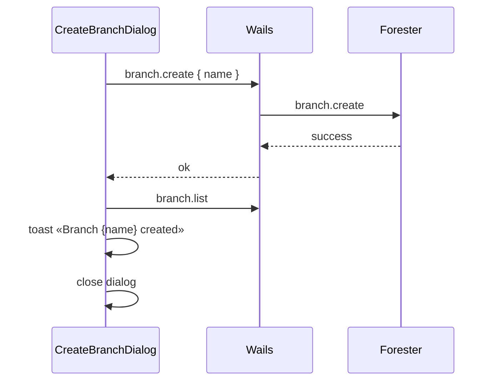

# Create Branch Dialog

Диалог создания новой ветки из History Sidebar.

**API:** [api-contract.md](./api-contract.md) — `branch.create`, `branch.list`

**Связанные документы:** [sidebar-history-view.md §2.2](./sidebar-history-view.md) · [design-tokens.md §4.5](./design-tokens.md)

---

## 1. Триггер

**History → Branch selector** dropdown → пункт **Create new branch…** (паттерн как **Add repository…** в [sidebar-project-view.md](./sidebar-project-view.md) / `RepoSelector`).

- Separator после списка веток
- Иконка `Plus` + label `Create new branch…`
- Dropdown закрывается; открывается `Dialog`

---

## 2. Структура

| # | Element | Spec |
|---|---------|------|
| 1 | Title | `Do you really want to create a new branch?` |
| 2 | Close | `X` icon top-right (стандартный `DialogContent`) |
| 3 | Branch name | `Input` — placeholder `feature/my-branch` |
| 4 | Cancel | `Button variant="outline"` — `Cancel` |
| 5 | Create | `Button variant="default"` — `Create` (disabled пока имя пустое) |

---

## 3. Submit flow



### 3.1 API

```json
// args
{ "name": "feature/ui" }

// optional: branch from specific commit (v1 GUI не передаёт)
{ "name": "feature/ui", "commit_hash": "abc…" }
```

Default (без `commit_hash`): ветка от **tip текущей ветки** (`currentBranch` HEAD).

### 3.2 После успеха

1. Refresh `branch.list` — новая ветка в dropdown
2. Toast: `Branch {name} created`
3. **`currentBranch` не меняется** — checkout только через выбор в dropdown (§2.6 [sidebar-history-view.md](./sidebar-history-view.md))
4. History log **не** перезагружается (ветка не переключена)

---

## 4. Валидация и ошибки

| Ситуация | Поведение |
|----------|-----------|
| Пустое имя | Create disabled |
| Invalid name (Forester) | Error toast; dialog open |
| Branch already exists | Error toast; dialog open |
| No commits to branch from | Error toast (empty repo edge case) |
| Enter в Input | Submit если имя не пустое |
| Cancel / overlay / Esc | Close; сброс поля |

---

## 5. Disabled states

| Состояние | Create new branch… |
|-----------|-------------------|
| `switchingBranch` | Branch selector disabled (включая create) |
| Merge in progress (v2) | Disabled |
