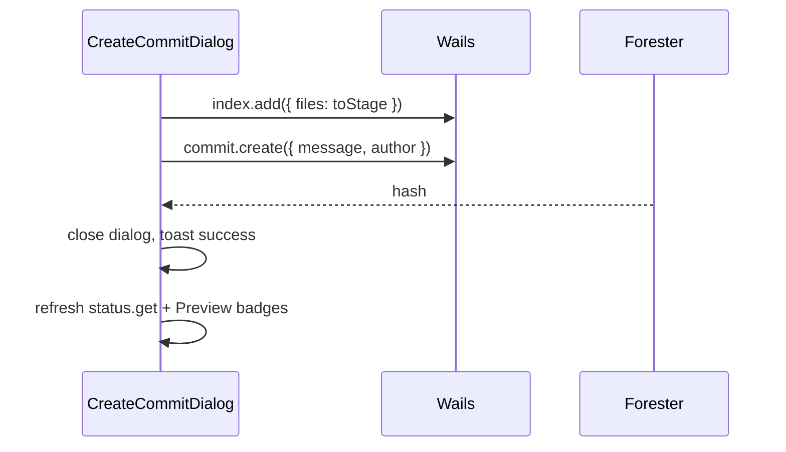

# Create Commit Dialog

Диалог создания коммита из Content Info.

**Figma:** [`4037:1076`](https://www.figma.com/design/Vhp8g306WGBcjSzL4lnl23/?node-id=4037-1076)

**API:** [api-contract.md](./api-contract.md) — `index.add`, `commit.create`, `status.get`

**Связанные документы:** [content-info-project-view.md](./content-info-project-view.md)

---

## 1. Триггер

**Create commit** button в footer Content Info → `Dialog` open.

Pre-step:

```ts
const committable = committablePaths(status) // sidebar-project-view §3.2
const toStage = selectedPaths.filter(p => committable.includes(p))
if (toStage.length === 0) { toast; return }
if (toStage.length < selectedPaths.length) { toast «N of M files will be committed» }
await index.add({ files: toStage })
```

---

## 2. Структура

| # | Element | Spec |
|---|---------|------|
| 1 | Title | `text-lg font-semibold` — `Create commit` |
| 2 | Close | `X` icon top-right |
| 3 | Author label | `text-sm text-muted-foreground` — `Author` |
| 4 | Author value | read-only text below label — from `setup.cfg` `[user].name` |
| 5 | Message | `Input` placeholder `Write commit...` — **subject** (required) |
| 6 | Description | `Textarea` placeholder `Description...` — optional body |
| 7 | Cancel | `Button variant="outline"` |
| 8 | Create | `Button variant="default"` — `Create` |

### 2.1 Message format

On submit:

```ts
const fullMessage = description.trim()
  ? `${subject.trim()}\n\n${description.trim()}`
  : subject.trim()
```

Same convention as [commit-card.md](./commit-card.md) parsing.

---

## 3. Submit flow



---

## 4. Validation

| Rule | Error |
|------|-------|
| Subject empty | disable Create / inline «Message required» |
| Subject only whitespace | treat as empty |
| No committable in selection | don't open dialog (§1) |
| `commit.create` fail | toast + keep dialog open |

---

## 5. States

| State | UI |
|-------|-----|
| Open | form empty |
| Submitting | Create disabled + spinner |
| Success | close + toast «Commit {shortHash} created» |

---

## 6. Props

```ts
interface CreateCommitDialogProps {
  open: boolean
  onOpenChange: (open: boolean) => void
  author: string
  selectedPaths: string[]
  repoPath: string
}
```

---

## 7. Corner cases

| Case | Поведение |
|------|-----------|
| Multiselect 5 files | stage committable subset only |
| File already staged | `index.add` idempotent |
| Staged deletion in selection | included in committable |
| Partial stage fail | toast which files failed; abort commit |
| Empty author in config | show «Unknown» + warn in toast |
| ESC / Cancel | close without commit |
| Click outside | close (Dialog default) |

---

## 8. shadcn/ui

`Dialog`, `DialogContent`, `DialogHeader`, `DialogFooter`, `Input`, `Textarea`, `Button`, `Label`
