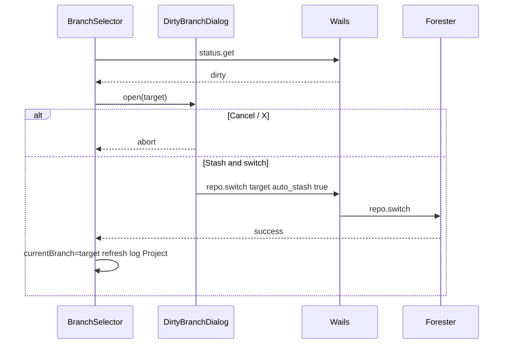

# Dirty Branch Switch Dialog

Диалог при checkout ветки с **dirty** рабочей копией (GitHub Desktop model).

**Figma:** [`4040:8317`](https://www.figma.com/design/Vhp8g306WGBcjSzL4lnl23/?node-id=4040-8317) — instance `Dialog Dirty branch switch` (shadcn `Dialog` + slot body)

**API:** [api-contract.md](./api-contract.md) — `status.get`, `repo.switch` (`auto_stash`)

**Связанные документы:** [sidebar-history-view.md §2.6](./sidebar-history-view.md) · [design-tokens.md §3](./design-tokens.md)

---

## 1. Триггер

`BranchSelector` (History Sidebar): пользователь выбрал ветку `target` ≠ `currentBranch` и `status.get` показывает dirty tree.

**Dirty** = любой непустой массив в `status.get` (staged / unstaged / untracked) или merge in progress.

---

## 2. Структура

| # | Element | Spec |
|---|---------|------|
| 1 | Title | `text-lg font-semibold` — `Switch branch to "{target}"?` |
| 2 | Close | `X` top-right — same as Create commit dialog |
| 3 | Body | `text-sm text-muted-foreground` — summary uncommitted changes |
| 4 | Cancel | `Button variant="outline"` |
| 5 | Stash & switch | `Button variant="default"` — primary |

### 2.1 Body copy

```
You have uncommitted changes:
• {n} modified
• {m} untracked
• {k} staged          // optional line if staged > 0
```

Строки с нулевым count **не показывать**.

### 2.2 Кнопки (v1)

| Button | Action |
|--------|--------|
| **Cancel** | Close dialog; branch dropdown reverts to `currentBranch` |
| **Stash & switch** | `repo.switch({ target, auto_stash: true })` |
| Close (X) | Same as Cancel |

**Discard & switch** — v1.1 (требует `workdir.discard` / reset API). **Try anyway** без stash — не в v1 (Forester отклоняет switch).

---

## 3. Flow



---

## 4. Corner cases

| Case | UI |
|------|-----|
| Merge in progress | Dialog **не открывать** — banner «Merge in progress»; checkout blocked |
| `repo.switch` fail | Toast error; stay on `currentBranch`; dropdown revert |
| Target = current | No dialog (no-op) |
| Only untracked | Body: `• N untracked` only |
| Only staged | Body: `• N staged` only |
| Long branch name | Title truncate + `title` tooltip |
| Switch in flight | Disable buttons + spinner on primary |

---

## 5. React mapping

```tsx
<AlertDialog open={open} onOpenChange={setOpen}>
  <AlertDialogContent>
    <AlertDialogHeader>
      <AlertDialogTitle>Switch branch to &quot;{target}&quot;?</AlertDialogTitle>
      <AlertDialogDescription asChild>
        <DirtySummary status={status} />
      </AlertDialogDescription>
    </AlertDialogHeader>
    <AlertDialogFooter>
      <AlertDialogCancel>Cancel</AlertDialogCancel>
      <AlertDialogAction onClick={onStashAndSwitch}>
        Stash &amp; switch
      </AlertDialogAction>
    </AlertDialogFooter>
  </AlertDialogContent>
</AlertDialog>
```

Использовать shadcn `AlertDialog` или `Dialog` — визуально как [create-commit-dialog.md](./create-commit-dialog.md).

---

## 6. Решения

| # | Тема | Решение |
|---|------|---------|
| 1 | Primary label | **Stash & switch** (Figma `4040:8317`) |
| 2 | Close X | = Cancel |
| 3 | Discard | v1.1 |
