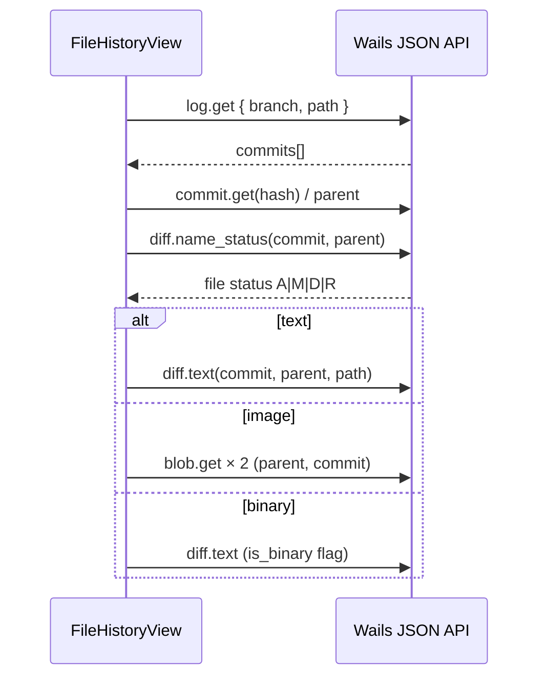

# Content Preview — File History View

Подрежим **Content Preview** в **Project view**: полноэкранный (в колонке Preview) просмотр истории **одного файла** — diff выбранной версии коммита vs parent, с управлением веткой / коммитом / Revert / Compare.

**UX-ориентир:** GitHub Desktop (file history / blame-adjacent flow) + переиспользование diff-компонентов из History mode.

**Figma (shadcn kit):**
- [File History View — компонент](https://www.figma.com/design/Vhp8g306WGBcjSzL4lnl23/?node-id=4012-13411) — `4012:13411`
- [Окно GUI (Sidebar + Preview)](https://www.figma.com/design/Vhp8g306WGBcjSzL4lnl23/?node-id=4083-5022) — `4083:5022` · колонка Preview: `4083:5787`

**Цвета:** [design-tokens.md](./design-tokens.md) §3.5 (diff) · §4.5 (dropdowns)

**Стек:** Wails (Go backend) + React + shadcn/ui

**Связанные документы:** [architecture.md](./architecture.md) · [content-preview-project-view.md](./content-preview-project-view.md) · [content-info-project-view.md](./content-info-project-view.md) · [file-viewer.md](./file-viewer.md) · [info-history-section.md](./info-history-section.md) · [diff-view.md](./diff-view.md)

**Atom specs (переиспользование):**

| Компонент | Документ |
|-----------|----------|
| Diff container | [diff-view.md](./diff-view.md) |
| Text diff | [text-diff-panel.md](./text-diff-panel.md) |
| Image diff | [image-diff-panel.md](./image-diff-panel.md) |
| Binary stub | [binary-diff-stub.md](./binary-diff-stub.md) |
| Deleted stub | [deleted-diff-stub.md](./deleted-diff-stub.md) |

---

## 1. Назначение и layout

### 1.1 Место в приложении

File History View — **не** отдельный `sidebarMode`. Это подрежим центральной колонки при `sidebarMode === 'project'`:

| `projectPreviewMode` | Content Preview | Content Info |
|----------------------|-----------------|--------------|
| `grid` (default) | Сетка папок / файлов | Preview, Metadata, History (**Views History** или Alert), Create commit |
| `fileViewer` | [File Viewer](./file-viewer.md) | **Видна** — single + **Edit in** + History (**Views History** или Alert) |
| `fileHistory` | **File History View** | **Скрыта** — Preview на всю ширину (как History mode) |

```
Project view + fileHistory:
┌──────────┬────────────────────────────────────────────────────────────┐
│ Sidebar  │  File History View (Content Preview)                       │
│ Project  │  [←] [branch] [commit] [Compare] [Revert]                   │
│          │  [file path bar + status badge]                            │
│          │  [DiffView — text / image / binary / D]                    │
└──────────┴────────────────────────────────────────────────────────────┘
```

Ширины: Preview min **747px**; Content Info **не рендерится** — [panel-layout.md](./panel-layout.md) (как History mode).

### 1.2 Вход (триггеры)

| Триггер | Условие | Действие |
|---------|---------|----------|
| Кнопка **Views History** в Content Info | `PreviewSelection.kind === 'files'` и `paths.length === 1` и `log.get`+`path` → `commits.length > 0` | `projectPreviewMode = 'fileHistory'`, `fileHistoryPath = primary` |
| **Double-click** по `FilePreviewItem` | — | **Не** открывает File History — см. [file-viewer.md §1.2](./file-viewer.md) |
| **Enter** на сфокусированном файле | — | **Не** открывает File History — см. [file-viewer.md](./file-viewer.md) |

**Выход:** кнопка `<` (Back) в toolbar — см. §1.2.1. Папка / selection / scroll **не сбрасываются**.

#### 1.2.1 Куда возвращает Back

При открытии File History запоминается `fileHistoryReturnMode`:

| Откуда открыли History | `fileHistoryReturnMode` | Back `<` → |
|------------------------|-------------------------|------------|
| **Grid** (View в Content Info, файл выбран в сетке) | `grid` | `projectPreviewMode = 'grid'` |
| **[File Viewer](./file-viewer.md)** (View в Content Info при `fileViewer`) | `fileViewer` | `projectPreviewMode = 'fileViewer'` (тот же `fileViewerPath`) |

```ts
openFileHistory(path) {
  fileHistoryReturnMode = projectPreviewMode === 'fileViewer' ? 'fileViewer' : 'grid'
  projectPreviewMode = 'fileHistory'
  fileHistoryPath = path
  // fileViewerPath сохраняется при returnMode === 'fileViewer'
}

closeFileHistory() {
  if (fileHistoryReturnMode === 'fileViewer' && fileViewerPath) {
    projectPreviewMode = 'fileViewer'
  } else {
    projectPreviewMode = 'grid'
    fileViewerPath = null   // сброс при возврате в grid
  }
  fileHistoryPath = null
  fileHistoryReturnMode = 'grid'
}
```

Label кнопки Back: `fileHistory.backToViewer` vs `fileHistory.back` (tooltip).

### 1.3 Связь с Content Info

После ввода [info-history-section.md](./info-history-section.md):

| Было (Content Info History) | Стало |
|-----------------------------|-------|
| Branch + Commit pickers | **Перенесены** в toolbar File History View |
| Revert + Compare | **Перенесены** в toolbar File History View |
| — | Кнопка **Views History** (primary / full width) — единственное действие секции History **при наличии коммитов** |
| — | Alert «No history of changes» — если `commits.length === 0` ([info-history-section.md §2.2](./info-history-section.md)) |

Секция History в Content Info при multiselect по-прежнему **не рендерится**.

### 1.4 Double-click (не входит в File History)

Double-click / Enter открывают **[File Viewer](./file-viewer.md)**, не File History View.

| Жест | Действие |
|------|----------|
| Double-click файл | [file-viewer.md §1.2](./file-viewer.md) |
| Enter на файле | File Viewer |

Открытие в приложении ОС — **context menu** (`workdir.open`) — [content-preview-project-view.md](./content-preview-project-view.md).

### 1.5 Зафиксированные решения

| # | Тема | Решение |
|---|------|---------|
| 1 | Baseline diff | **Выбранный коммит vs parent** (first parent); тот же контракт, что [content-preview-history-view.md §1.3](./content-preview-history-view.md) |
| 2 | Источник коммитов | `log.get` + `path` (file log), не весь branch log |
| 3 | Branch picker | **Read-only filter** для file log — **не** `repo.switch` ([info-history-section.md §2.1](./info-history-section.md)) |
| 4 | Default commit | Первый коммит в file log (newest) |
| 5 | Default branch | `dfm.info.fileHistoryBranch` → `currentBranch` → первый из `branch.list` |
| 6 | Diff UI | Переиспользовать `DiffView` + дочерние панели без дублирования логики |
| 7 | Compare (header) | Только для `DiffKind === 'binary'`; one-shot `compare.extract` (не toggle) |
| 8 | Revert (header) | Для **всех** типов файла; `restore.file` + `AlertDialog` |
| 9 | Rail → History | Авто-выход в `grid` (сброс viewer + history) |
| 10 | Sidebar: смена папки | Авто-выход в `grid` |
| 11 | Back из History | По `fileHistoryReturnMode`: **viewer** или **grid** (§1.2.1) |
| 12 | Multiselect в grid | View недоступен; double-click → [File Viewer](./file-viewer.md) |

---

## 2. Анатомия UI

### 2.1 Toolbar (node `4083:5382`)

`flex items-center gap-1`, `px-2 py-1.5`, нижняя граница `border-b border-border`.

```
┌──────────────────────────────────────────────────────────────────────────┐
│ [<] │ [Select branch… ▼] [Select commit… ▼] [Compare] [Revert]         │
└──────────────────────────────────────────────────────────────────────────┘
```

| # | Элемент | Spec | Поведение |
|---|---------|------|-----------|
| 1 | **Back** `<` | `Button` ghost **40×40**, `ChevronLeft` 16 | `projectPreviewMode = 'grid'` (§1.2) |
| — | Spacer | optional vertical separator 24px | как в макете `4083:5388` |
| 2 | **Branch** | `DropdownSelector`, `flex-1`, min-h 36 | §3.1 |
| 3 | **Commit** | `DropdownSelector`, `flex-1`, min-h 36 | §3.2 |
| 4 | **Compare** | `Button variant="outline"`, h 40, `flex-1` | §3.4 — visible when binary |
| 5 | **Revert** | `Button variant="default"`, h 40, `flex-1` | §3.3 |

Порядок кнопок справа: **Compare** (outline) → **Revert** (primary) — как Figma `4083:5788` / `4083:5763`.

На узких ширинах Preview: branch/commit `min-w-0`; кнопки не переносятся на вторую строку (truncate в dropdown labels).

### 2.2 File info bar (node `4083:5509`)

`bg-accent`, `px-2 py-2`, под toolbar, над diff.

| Элемент | Spec |
|---------|------|
| Path | `text-xs`, truncate, **full relative path** с leading `/` в UI (`/assets/foo.txt`) |
| Tooltip | full path без искусственного leading slash |
| Status badge | `Badge` pill — **A / M / D / R** для файла в выбранном коммите ([history-changed-file-item.md](./history-changed-file-item.md)); источник: `diff.name_status` |

Path в toolbar `DiffView` **скрыт** (`hidePathInToolbar` — §6.2); канонический путь — только в file info bar (Figma).

### 2.3 Content — DiffView

`flex-1 min-h-0 overflow-hidden` — монтируется [diff-view.md](./diff-view.md).

| Diff kind | Toolbar в DiffView | Content |
|-----------|-------------------|---------|
| `text` | Unified / Split toggles (без path) | `TextDiffPanel` |
| `image` | 2-up / Swipe / Overlay (Figma: Slider = Swipe) | `ImageDiffPanel` |
| `binary` | нет | `BinaryDiffStub` |
| `deleted` | нет | `DeletedDiffStub` |

Классификация и маршрутизация — [diff-view.md §3](./diff-view.md). Layout defaults / persist — те же ключи, что History Preview ([content-preview-history-view.md §5.2](./content-preview-history-view.md)).

### 2.4 shadcn/ui mapping

| UI | Component |
|----|-----------|
| Back | `Button` variant `ghost` |
| Branch / Commit | `DropdownSelector` — [design-tokens.md §4.5](./design-tokens.md) |
| Compare | `Button` variant `outline` |
| Revert | `Button` variant `default` |
| Status badge | `Badge` |
| Revert confirm | `AlertDialog` |
| Diff area | `DiffView` + children |

---

## 3. Поведение controls

### 3.1 Branch picker

Идентично [info-history-section.md §2.1](./info-history-section.md):

- Options: `branch.list`
- Placeholder: `Select branch…`
- On change: reload `log.get`+`path`; reset commit to newest in list; persist `dfm.info.fileHistoryBranch`
- **Не** вызывает `repo.switch`

### 3.2 Commit picker

Идентично [info-history-section.md §2.2](./info-history-section.md):

- Source: `log.get { branch, path: fileHistoryPath, max_count: 100 }`
- Trigger label: `{shortHash} · {truncated subject}`
- Tooltip: полная строка + timestamp
- On change: reload diff (§4)
- Empty: placeholder `No commits for this file`; diff area — empty state

### 3.3 Revert

Flow = [info-history-section.md §4.1](./info-history-section.md):

1. Require `historyCommit` selected
2. `lock.list` — block foreign lock
3. `AlertDialog`: «Overwrite file in working directory with version from commit {shortHash}?»
4. `restore.file({ commit_hash, paths: [fileHistoryPath] })`
5. Success: toast; `status.get`; bump preview generation; refresh Metadata в Content Info

**Enabled** для text / image / binary / deleted (deleted → восстановление файла из parent blob в коммите, если API поддерживает; иначе disabled + tooltip).

Кнопка в toolbar **всегда видна** (не только для binary).

### 3.4 Compare

**Назначение:** бинарные файлы без inline diff ([binary-diff-stub.md](./binary-diff-stub.md)).

| Property | Value |
|----------|-------|
| Visibility | `display: none` или не рендерить, если `DiffKind !== 'binary'` |
| Enabled | `historyCommit` selected, not `acting` |
| Variant | `outline` (не toggle) |
| Action | One-shot: `compare.extract({ commit_hash })` → `.DFM/tmp_review`; `workdir.open` на tmp folder; toast с путём |

Отличие от старого Content Info Compare: **не** toggle `pressed` / cleanup по повторному клику в header — повторный extract заменяет предыдущий ([content-info-project-view.md §6.5](./content-info-project-view.md)). Cleanup при unmount File History View и при Back.

`BinaryDiffStub` внутри diff **сохраняет** кнопку «Open in external application» для blob версии коммита ([binary-diff-stub.md §4](./binary-diff-stub.md)) — это отдельное действие от header Compare.

---

## 4. Загрузка diff

### 4.1 Триггеры reload

- Смена `historyCommit`
- Смена `fileHistoryPath` (повторный вход с другим файлом)
- Retry из `DiffView`

### 4.2 Sequence



### 4.3 Stale request guard

Как [HistoryPreviewPanel](./content-preview-history-view.md): generation counter / abort при смене commit или path до ответа.

### 4.4 Initial commit (no parent)

Тот же fallback, что History Preview: diff для **added** файла без parent blob ([diff-view.md §7](./diff-view.md)).

---

## 5. Состояние

### 5.1 Store (расширение project preview)

```ts
type ProjectPreviewMode = 'grid' | 'fileViewer' | 'fileHistory'
type FileHistoryReturnMode = 'grid' | 'fileViewer'

interface FileHistoryState {
  mode: ProjectPreviewMode
  fileHistoryPath: string | null
  fileHistoryReturnMode: FileHistoryReturnMode  // set on openFileHistory
  fileViewerPath: string | null                // preserved when returnMode === 'fileViewer'

  // Toolbar (shared keys with former Info History where noted)
  historyBranch: string | null
  historyCommit: string | null

  // Diff (mirror HistoryPreviewPanel slice)
  fileStatus: 'added' | 'modified' | 'deleted' | 'renamed' | null
  diffContent: string
  isBinary: boolean
  textLayout: 'unified' | 'split'
  imageLayout: '2up' | 'swipe' | 'overlay'
  beforeImageUrl: string | null
  afterImageUrl: string | null

  loadingBranches: boolean
  loadingCommits: boolean
  loadingDiff: boolean
  diffError: string | null

  compareExtractCommit: string | null  // for cleanup on exit
  acting: boolean
}
```

Живёт в `projectStore` или выделенном `fileHistoryStore` — на усмотрение реализации; контракт UI events — [api-contract.md §6](./api-contract.md) (дополнить).

### 5.2 Персистентность

| Key | Value |
|-----|-------|
| `dfm.info.fileHistoryBranch` | per-repo branch filter (уже есть) |
| `dfm.history.textLayout` | per-repo — reuse |
| `dfm.history.imageLayout` | per-repo — reuse |

`projectPreviewMode` и `filePath` **не** персистятся — при reload app всегда `grid`.

### 5.3 Восстановление grid при Back

Сохранять в session (memory only):

- `selectedFolderPath`, navigation stack Preview
- `selectedFilePaths` / `primary`
- scroll offset сетки (best-effort v1.1)

---

## 6. Компоненты (React)

```
frontend/src/components/preview/
  FileHistoryView.tsx          # orchestration: toolbar + file bar + diff loaders
  FileHistoryToolbar.tsx       # optional split
  ProjectPreviewPanel.tsx      # switch grid | fileHistory

frontend/src/components/info/
  InfoHistorySection.tsx       # Views History or no-history Alert; commitCount from ContentInfoPanel

# Reuse without fork:
  DiffView.tsx                 # + optional hidePathInToolbar
  TextDiffPanel.tsx
  ImageDiffPanel.tsx
  BinaryDiffStub.tsx
  DeletedDiffStub.tsx
```

### 6.1 `FileHistoryView` props

```ts
interface FileHistoryViewProps {
  filePath: string
  onBack: () => void
}
```

### 6.2 Расширение `DiffView`

```ts
interface DiffViewProps {
  // ...existing
  hidePathInToolbar?: boolean   // default false; true in File History View
}
```

---

## 7. Backend API

Канон: [api-contract.md](./api-contract.md).

| Method | Назначение |
|--------|------------|
| `branch.list` | Branch picker |
| `log.get` + `path` | Commit picker (file log) |
| `commit.get` | Parent hash, blend screenshot path |
| `diff.name_status` | Status badge A/M/D/R |
| `diff.text` | Text diff + `is_binary` |
| `blob.get` | Image before/after |
| `restore.file` | Revert |
| `compare.extract` | Header Compare (binary) |
| `lock.list` | Pre-revert check |
| `status.get` | Post-revert refresh |

---

## 8. Corner cases

### 8.1 Нет repo

File History не открывается из Content Info; empty shell как в Project Preview.

### 8.2 Файл never committed

**Content Info:** кнопка Views History **скрыта**; Alert в секции History ([info-history-section.md](./info-history-section.md)).

**File History View** (если открыт иным путём): commit list empty; placeholder в commit picker; diff area: «No commits for this file»; Revert / Compare disabled.

### 8.3 Файл удалён с диска (working tree)

File History открывается; diff по коммитам работает; Revert **восстанавливает** файл; Metadata в Info — partial ([content-info-project-view.md §6.2](./content-info-project-view.md)).

### 8.4 Multiselect active + double-click

Открывается history файла под курсором; selection **не** сбрасывается до single.

### 8.5 Views History при multiselect

Кнопка **не рендерится** (History section hidden).

### 8.6 Быстрая смена commit / branch

Stale diff discarded; badge и diff синхронны с последним выбором.

### 8.7 Binary + Compare + Back

`compare.extract` cleanup (`cleanup: true`) при Back и unmount, если extract был для текущего commit.

### 8.8 Renamed file в коммите

File info bar: `old/path → new/path`; diff на **new** path ([diff-view.md §4.1](./diff-view.md)).

### 8.9 `svg`

Всегда text diff ([diff-view.md §3](./diff-view.md)).

### 8.10 `.blend` без screenshot

Binary stub generic icon; header Compare доступен.

### 8.11 Rail → History / смена папки в Sidebar

`projectPreviewMode = 'grid'`; File History state reset (кроме persisted branch filter).

### 8.12 View из File Viewer → History → Back

`fileHistoryReturnMode = 'fileViewer'` → Back восстанавливает **File Viewer** с тем же `fileViewerPath`; Content Info снова видна.

### 8.13 View из grid → History → Back

`fileHistoryReturnMode = 'grid'` → Back в сетку файлов.

### 8.14 Тот же файл: View когда уже в fileHistory

No-op или scroll-to-top; **не** сбрасывать commit selection.

### 8.15 `diff.text` → `file_too_large`

Inline error в `TextDiffPanel` + Retry ([content-preview-history-view.md](./content-preview-history-view.md)).

### 8.16 Unicode paths

Display UTF-8; API paths normalized per [paths.md](./paths.md).

---

## 9. i18n keys (новые / переиспользование)

| Key | EN (пример) |
|-----|-------------|
| `fileHistory.view` | Views History |
| `fileHistory.noHistoryTitle` | No history of changes |
| `fileHistory.noHistoryDescription` | The file is not added to any commit |
| `fileHistory.back` | Back to files |
| `fileHistory.backToViewer` | Back to file preview |
| `history.selectBranch` | reuse |
| `history.noCommitsForFile` | reuse |
| `commit.revertAction` | reuse |
| `common.compare` | reuse |
| `preview.selectFileChanges` | empty diff fallback |

---

## 10. Решения (закрытые)

| # | Тема | Решение |
|---|------|---------|
| 1 | Double-click | [File Viewer](./file-viewer.md), не File History |
| 2 | OS open | Context menu only |
| 3 | Content Info layout | **Скрыта** в fileHistory (Preview на всю ширину) |
| 4 | History controls | Только в Preview toolbar; Info → Views History или Alert |
| 5 | Compare UX | Outline button, binary-only, one-shot extract |
| 6 | Diff baseline | Commit vs parent |
| 7 | Branch picker | Read-only filter, не checkout |
| 8 | Diff components | Reuse `DiffView` stack |
| 9 | Exit | Back `<` по return stack (§1.2.1) + auto on folder/mode change |
| 10 | Path display | Full path в file info bar; basename не использовать |

---

## 11. Связанные изменения документации

При реализации обновить:

- [content-preview-project-view.md §1.3 #8, §4.4](./content-preview-project-view.md) — double-click → File History
- [info-history-section.md](./info-history-section.md) — View button, убрать pickers/actions
- [content-info-project-view.md §2.1](./content-info-project-view.md) — ссылка на File History View
- [architecture.md §2.0](./architecture.md) — `projectPreviewMode`
- [api-contract.md §6](./api-contract.md) — UI events `onOpenFileHistory` / `onCloseFileHistory`
