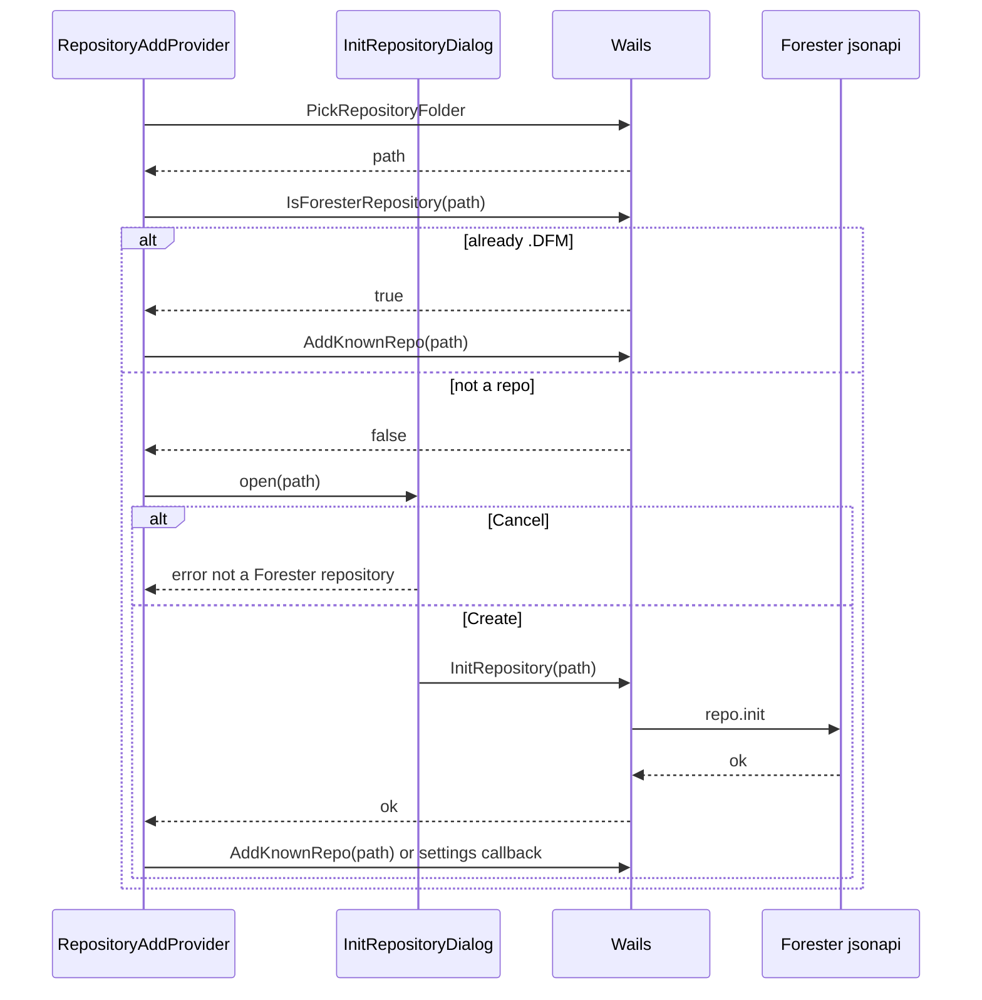

# Init Repository Dialog

Диалог при добавлении папки, которая **ещё не является** Forester-репозиторием (нет `.DFM`).

**Компонент:** `ConfirmAlertDialog` (shadcn `AlertDialog`) в `RepositoryAddProvider`

**API:** `IsForesterRepository`, `InitRepository` (`repo.init`), `AddKnownRepo` / `OpenRepo`

**Связанные документы:** [multi-repo.md §3](./multi-repo.md) · [decisions.md §8.3](./decisions.md) · [design-tokens.md §3](./design-tokens.md)

---

## 1. Триггер

После native **folder picker**, если выбранный путь **не** содержит каталог `.DFM` в корне.

Применяется во всех сценариях добавления папки:

| Место | Действие после **Create** |
|-------|---------------------------|
| `RepoSelector` → **+ Add repository…** | `InitRepository` → `AddKnownRepo` → `OpenRepo` → refresh Project |
| `EmptyRepoState` → **Add repository** | то же |
| `Settings` → Repositories → **Add repository** / **Select** | `InitRepository` → append path в локальный список (Save list позже) |
| **Re-open…** (error banner / empty state) | `InitRepository` → `AddKnownRepo` → `OpenRepo` |

Если путь **уже** Forester repo — диалог **не** показывать; выполнить обычный flow добавления/открытия.

---

## 2. Структура

| # | Element | Spec |
|---|---------|------|
| 1 | Title | `This folder is not a repository` |
| 2 | Description | `Do you want to make this folder a repository?` |
| 3 | Cancel | `Button` `AlertDialogCancel` — label **Cancel** |
| 4 | Create | `Button` `AlertDialogAction` — label **Create** (primary) |

**shadcn/ui:** `AlertDialog` + `AlertDialogContent` + `AlertDialogHeader` + `AlertDialogFooter` — как [dirty-branch-switch-dialog.md](./dirty-branch-switch-dialog.md).

Overlay блокирует взаимодействие с shell до выбора.

---

## 3. Действия кнопок

| Button | Action |
|--------|--------|
| **Cancel** | Закрыть диалог; показать ошибку `not a Forester repository` в существующем error state (toast / inline в empty state / banner) |
| **Create** | `InitRepository(path)` → `repo.init` в выбранной папке → callback успеха (см. §1) |
| Overlay dismiss / Esc | Same as **Cancel** |

При ошибке `InitRepository` или последующего `AddKnownRepo` — toast / `setError` с текстом API; диалог закрыть только после успешного **Create**.

Во время **Create**: disable обе кнопки; optional spinner на primary.

---

## 4. Flow



---

## 5. Wails API

| Метод | Назначение |
|-------|------------|
| `IsForesterRepository(path)` | `true` если `path/.DFM` — directory |
| `InitRepository(path)` | `jsonapi.CallStateless(path, "repo.init", {})`; idempotent если `.DFM` уже есть |
| `PickRepositoryFolder()` | Native folder picker (без изменений) |
| `AddKnownRepo(path)` | После init — append `path_N` + open (см. [multi-repo.md §5](./multi-repo.md)) |

---

## 6. Corner cases

| Case | UI |
|------|-----|
| Picker cancelled | No dialog; no error |
| Path not a directory | `InitRepository` error toast; stay on previous repo |
| `repo.init` fails (permissions, disk) | Toast API error; dialog остаётся или закрывается с error — показать message |
| `.DFM` уже есть (race) | `InitRepository` no-op → `AddKnownRepo` |
| Duplicate path in `[repo]` | `AddKnownRepo` dedupe `SamePath` — только switch current |
| Settings: Create без Save list | Path в UI-списке; persist при **Save list** |
| Settings Save list без init | Backend `SaveSettingsRepos` отклоняет: `not a Forester repository` |
| Concurrent Add из двух мест | Один dialog; `pendingPath` singleton в provider |
| Init во время открытого Settings | Dialog поверх Settings modal (z-index AlertDialog) |

---

## 7. React mapping

```tsx
<ConfirmAlertDialog
  open={open}
  title="This folder is not a repository"
  description="Do you want to make this folder a repository?"
  cancelLabel="Cancel"
  confirmLabel="Create"
  loading={loading}
  onCancel={handleCancel}   // setError("not a Forester repository")
  onConfirm={handleCreate}  // initRepository → onReady callback
/>
```

**Provider:** `RepositoryAddProvider` оборачивает `AppShell`; хук `useRepositoryAdd()` экспортирует `pickRepositoryPath` / `ensureRepositoryPath`.

Для non-React callers (`reopenRepositoryFromPicker`): `registerRepositoryAddActions` в `lib/repositoryAddActions.ts`.

---

## 8. Решения

| # | Тема | Решение |
|---|------|---------|
| 1 | Cancel | Error `not a Forester repository` (не wizard CLI) |
| 2 | Create | `repo.init` in-app, без терминала |
| 3 | Компонент | shadcn `AlertDialog` / `ConfirmAlertDialog` |
| 4 | Один диалог | Global provider, не дублировать в каждом экране |
| 5 | v1.1 | «Locate repository…» для переименованных путей — отдельно |
