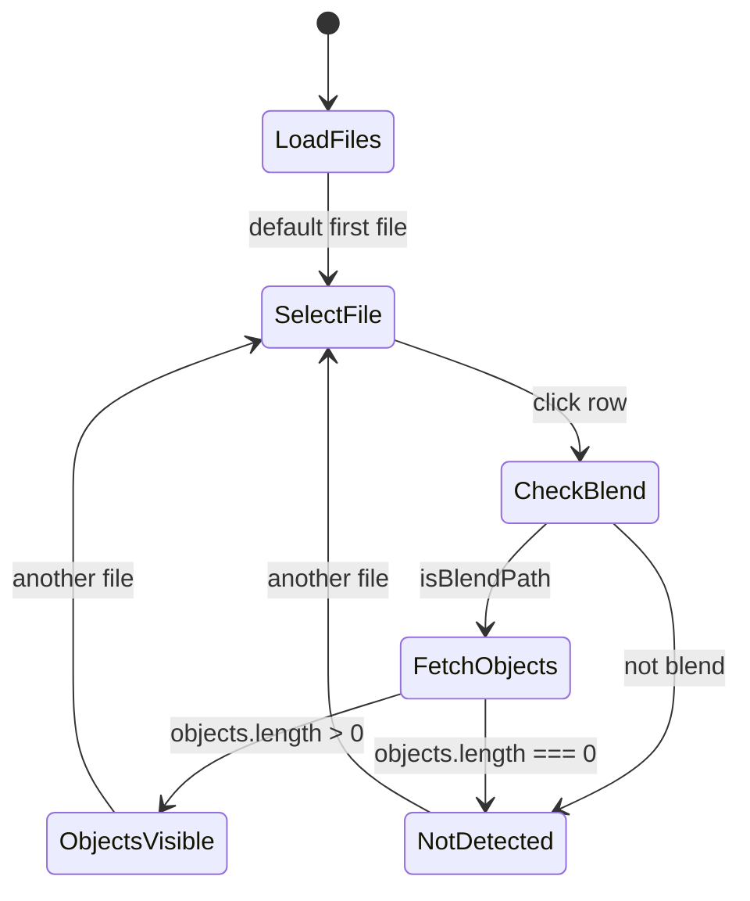
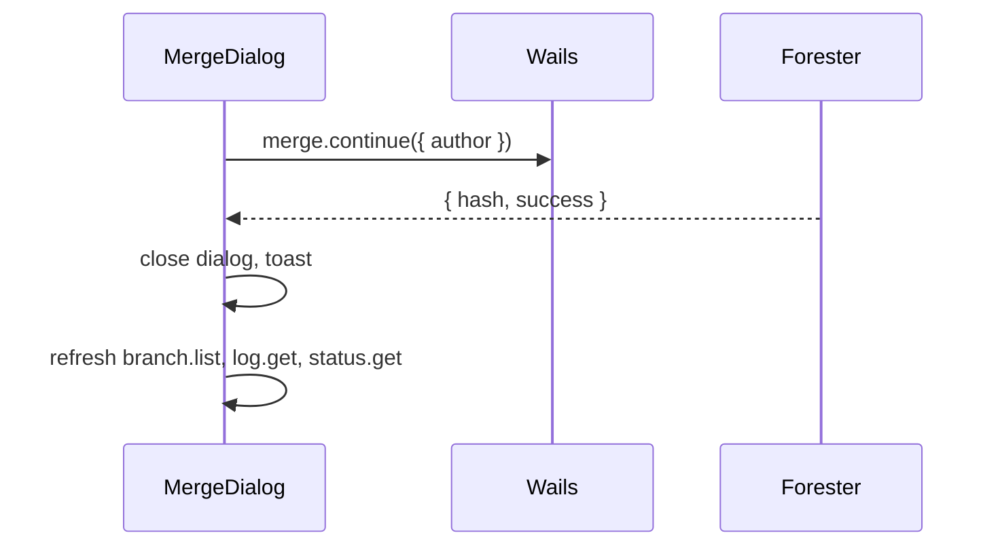

# Merge Dialog

Диалог **Merge commit**: обзор файлов слияния и object-level изменений в `.blend` перед завершением merge.

**Figma (shadcn kit):**
- Dialog — [`4039:1093`](https://www.figma.com/design/Vhp8g306WGBcjSzL4lnl23/?node-id=4039-1093)
- Merge list states (objects visible / not detected) — [`4039:1041`](https://www.figma.com/design/Vhp8g306WGBcjSzL4lnl23/?node-id=4039-1041)

**API:** [api-contract.md](./api-contract.md) — `merge.status`, `merge.continue`, `objects.by_file`, `diff.name_status`

**Связанные документы:** [sidebar-history-view.md](./sidebar-history-view.md) · [history-changed-file-item.md](./history-changed-file-item.md) · [create-commit-dialog.md](./create-commit-dialog.md)

---

## 1. Триггеры

| Источник | Условие | Действие |
|----------|---------|----------|
| History branch dropdown | «Merge into current branch…» | Открыть dialog с `targetBranch` |
| Banner «Merge in progress» | Клик **Review merge** | Открыть dialog (continue flow) |
| После `merge --no-commit` | Merge staged, conflicts resolved | Auto-open или кнопка в banner |

**Не открывать**, если:
- `currentBranch === targetBranch`
- `merge.status.in_progress` и есть unresolved conflicts (сначала resolve в Preview / Blender)
- Dirty tree без подтверждения (см. §8)

---

## 2. Layout диалога

```
┌──────────────────────────────────────────────────────────────┐  [X]
│ Merge commit                                                 │
│ Author                                                       │
│ {author name}                                                │
├──────────────────────────┬───────────────────────────────────┤
│ 3 files changed          │ 3 object in .blend                │
│──────────────────────────│───────────────────────────────────│
│ /path/file.txt           │ object_name              [status] │
│ /path/scene.blend [view] │ object_name              [status] │
│ /path/other.png          │ ...                               │
├──────────────────────────┴───────────────────────────────────┤
│                              [ Cancel ]  [ Merge ]           │
└──────────────────────────────────────────────────────────────┘
```

| Token | Значение |
|-------|----------|
| Dialog width | `~790px` (`max-w-3xl`) |
| Padding | `p-6` (`padding-lg`) |
| Gap sections | `gap-4` |
| Column width | `50%` each (`flex-1`), divider `border-r` |
| Border radius | `rounded-md` |
| Shadow | `shadow-lg` |

**shadcn/ui:** `Dialog`, `DialogContent`, `DialogHeader`, `DialogFooter`, `Button`, `Badge`, `ScrollArea`

---

## 3. Header

| # | Element | Spec |
|---|---------|------|
| 1 | Title | `text-lg font-semibold` — `Merge commit` |
| 2 | Close | `X` icon top-right (`DialogClose`) |
| 3 | Author label | `text-sm text-muted-foreground` — `Author` |
| 4 | Author value | `text-sm text-foreground` — `setup.cfg` `[user].name` |

Subline (optional, v1.1): `Merging {targetBranch} into {currentBranch}` под author.

---

## 4. Merge list — две колонки

Компонент `MergeList`: `flex gap-px`, full width, fixed height `min-h-[280px] max-h-[420px]`.

### 4.1 Левая колонка — File list

**Header row** (`h-[38px]`, `bg-accent`, `px-2`):

- Label: `{n} files changed` — `text-xs`
- `n` = длина списка файлов merge (§6.1)

**Rows** — `MergeFileRow`:

| Property | Spec |
|----------|------|
| Padding | `p-4` |
| Border | `border-b border-border` |
| Path | `text-base`, `truncate`, relative path `/`-style |
| Single select | одна строка `selectedFilePath` |

#### Состояния строки файла

| State | Background | Text | Trailing badge |
|-------|------------|------|----------------|
| **Default** | `bg-background` | `text-foreground` | см. ниже |
| **Selected** | `bg-primary` | `text-primary-foreground` | см. ниже |

**Trailing badge** (справа, `Badge`, pill `rounded-full`, `h-[22px] px-3 text-xs font-semibold`):

| Условие | Badge | Variant |
|---------|-------|---------|
| Selected + `.blend` + objects > 0 | `view object` | `secondary` (светлый на тёмном selected row) |
| Иначе + есть VCS/merge status | `A` / `M` / `D` / `conflict` | `default` (тёмный) |
| Нет status | — | badge не рендерится |

VCS status codes — как [history-changed-file-item.md](./history-changed-file-item.md) §3.

**Клик по строке:** `setSelectedFilePath(path)` → пересчитать правую колонку (§5).

### 4.2 Правая колонка — Object list

Зависит от выбранного файла в левой колонке.

---

## 5. Два состояния правой колонки

Канон: [Figma `4039:1041`](https://www.figma.com/design/Vhp8g306WGBcjSzL4lnl23/?node-id=4039-1041).

### 5.1 `objectsVisible` — объекты есть

**Условие** (все true):

1. `selectedFilePath` ends with `.blend` (`isBlendPath`)
2. `objects.by_file` вернул `objects.length > 0` для merge commit hash

**Header:** `{n} object in .blend` (singular: `1 object in .blend`)

**Rows** — `MergeObjectRow`:

| Property | Spec |
|----------|------|
| Padding | `p-4`, `border-b` |
| Name | `text-base`, `object_name` |
| Badge | `Badge default` — merge tag / status |

**Object status badge** — primary tag из `tags[]`:

| Tag | Label | Meaning |
|-----|-------|---------|
| `DELETE` | `delete` | object removed in merge |
| `RENAME` | `rename` | object renamed (`metadata.new_name`) |
| `MERGE` | `merge` | object merged / replaced |
| (none) | `changed` | object touched, no explicit tag |

`Tooltip` на badge: полный tag + optional `metadata`.

**Scroll:** `ScrollArea` на обеих колонках при overflow.

### 5.2 `objectsNotDetected` — объекты недоступны

**Условие** (любое):

- Выбран **не** `.blend` файл
- Выбран `.blend`, но `objects.by_file` → `[]`
- `.blend` без object metadata в `.DFM/objects/` (addon не пометил объекты)
- API error / loading failed

**Header:** `Objects not detected` — `text-xs`, `bg-accent`

**Body:** **пусто** — без placeholder rows, без иконок.

> Правая колонка остаётся той же ширины (50%), чтобы layout не прыгал при смене файла.

### 5.3 State diagram



---

## 6. Backend API

Канон: [api-contract.md](./api-contract.md).

### 6.1 Список файлов

Источник при открытии dialog:

```ts
// merge in progress — diff between MERGE_HEAD parents
const { from, to } = await merge.status()
const { files } = await diff.name_status({ from, to })

// pre-merge preview — current HEAD vs target branch tip
const { files } = await diff.name_status({
  from: currentBranchTip,
  to: targetBranchTip,
})
```

### 6.2 Объекты `.blend`

```json
// objects.by_file
{ "path": "assets/scene.blend", "commit_hash": "<merge_commit_or_head>" }
→ {
  "objects": [
    {
      "object_name": "Cube",
      "object_type": "MESH",
      "tags": ["MERGE"],
      "metadata": { "new_name": "Cube_v2" }
    }
  ]
}
```

Источник данных: Forester `objects` table / `.DFM/objects/{commit_hash}_objects.json` (Blender addon).

### 6.3 Submit — Merge



Если merge ещё не начат (pre-merge dialog):

```ts
await merge.start({ branch: targetBranch })  // CLI: merge <branch> --no-commit
// при успехе без конфликтов → merge.continue
// при конфликтах → close dialog, banner + Preview diff
```

---

## 7. Footer

| Button | Variant | Action |
|--------|---------|--------|
| **Cancel** | `outline` | `onOpenChange(false)` — не менять merge state |
| **Merge** | `default` | §6.3 |

**Merge disabled when:**
- `merge.status.has_conflicts === true`
- Submitting (spinner)
- File list empty

**Success toast:** `Merge commit {shortHash} created`

---

## 8. Corner cases

| Case | Поведение |
|------|-----------|
| Non-`.blend` selected | Right pane `Objects not detected` |
| `.blend` без object tags | `Objects not detected` |
| `.blend` с objects, другой файл selected | Переключить на `Objects not detected` или objects list |
| Первый файл при open | Auto-select first row in file list |
| `objects.by_file` loading | Right header skeleton; rows skeleton × 2 |
| `objects.by_file` error | `Objects not detected` + toast |
| Merge conflicts unresolved | Dialog read-only preview OR block Merge button |
| Fast click между `.blend` files | Cancel stale `objects.by_file` responses |
| Unicode paths / object names | UTF-8 display, truncate + tooltip |
| 0 files in merge | Empty state в левой колонке: «No files to merge»; Merge disabled |
| User closes mid-merge | Merge state сохраняется (`MERGE_HEAD`); banner остаётся |
| ESC / Cancel | Close без `merge.continue` |
| Double-click file row | No-op (только single select) |
| Long path | `truncate` + `title` tooltip |
| Author empty in cfg | `Unknown` |

---

## 9. Props

```ts
type MergeListMode = 'objectsVisible' | 'objectsNotDetected'

interface MergeDialogProps {
  open: boolean
  onOpenChange: (open: boolean) => void
  repoPath: string
  targetBranch: string
  currentBranch: string
  author: string
  mode?: 'preview' | 'continue'  // preview = before merge.start
}

interface MergeFileRow {
  path: string
  status: 'A' | 'M' | 'D'
  objectCount?: number  // cached after first fetch
}

interface MergeObjectRow {
  object_name: string
  tags: string[]
  metadata?: Record<string, string>
}
```

---

## 10. Компоненты (React)

```
frontend/src/components/merge/
  MergeDialog.tsx
  MergeList.tsx
  MergeFileRow.tsx
  MergeObjectRow.tsx
  mergeDialogStore.ts
```

---

## 11. Решения (закрытые)

| # | Тема | Решение |
|---|------|---------|
| 1 | Object panel empty state | Только header «Objects not detected», без body |
| 2 | `view object` badge | Только на selected `.blend` с objects > 0 |
| 3 | File row selected style | `bg-primary` + `text-primary-foreground` (как Figma) |
| 4 | Object status labels | Lowercase tag: `delete`, `rename`, `merge` |
| 5 | Scope v1 | Dialog spec + API stubs; branch merge menu — v2 в [sidebar-history-view.md](./sidebar-history-view.md) |
