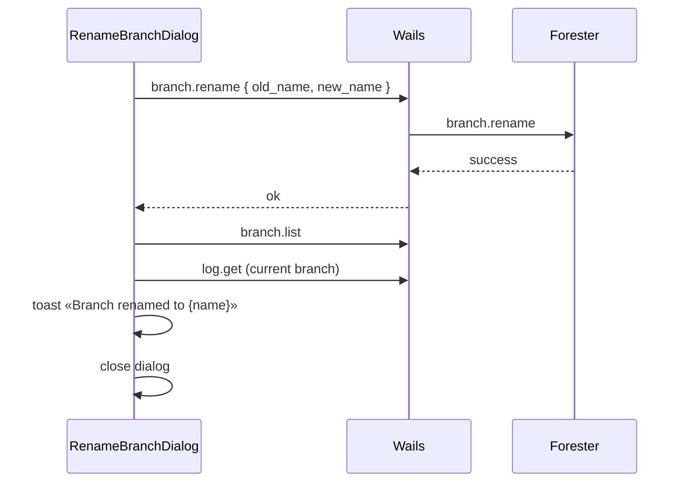

# Rename Branch Dialog

Диалог переименования **текущей** ветки из History Sidebar.

**API:** [api-contract.md](./api-contract.md) — `branch.rename`, `branch.list`

**Связанные документы:** [sidebar-history-view.md §2.2](./sidebar-history-view.md) · [create-branch-dialog.md](./create-branch-dialog.md) · [design-tokens.md §4.5](./design-tokens.md)

---

## 1. Триггер

**History → Branch selector** dropdown → пункт **Rename branch…** сразу после **Create new branch…**.

- Тот же footer-блок (`Separator` после списка веток)
- Иконка `Pencil` + label `Rename branch…`
- Dropdown закрывается; открывается `Dialog`
- Переименовывается **`currentBranch`** (ветка рабочей копии), не произвольная строка из списка

---

## 2. Структура

| # | Element | Spec |
|---|---------|------|
| 1 | Title | `Rename branch` |
| 2 | Close | `X` icon top-right (стандартный `DialogContent`) |
| 3 | Branch name | `Input` — prefilled `currentBranch`, placeholder `feature/my-branch` |
| 4 | Cancel | `Button variant="outline"` — `Cancel` |
| 5 | Rename | `Button variant="default"` — `Rename` (disabled пока имя пустое или не изменилось) |

---

## 3. Submit flow



### 3.1 API

```json
{
  "old_name": "feature/ui",
  "new_name": "feature/ui-v2"
}
```

Forester обновляет `current_branch` ref, если переименована активная ветка.

### 3.2 После успеха

1. Refresh `branch.list` — новое имя в dropdown; `currentBranch` обновляется из `is_current`
2. Refresh `log.get` для текущей ветки (имя ветки изменилось, коммиты те же)
3. Toast: `Branch renamed to {name}`
4. Checkout **не** меняется (остаёмся на той же ветке под новым именем)

---

## 4. Валидация и ошибки

| Ситуация | Поведение |
|----------|-----------|
| Имя не изменилось | Rename disabled |
| Пустое имя | Rename disabled |
| Invalid name (Forester) | Error toast; dialog open |
| Branch already exists | Error toast; dialog open |
| Branch not found | Error toast (race / external delete) |
| Enter в Input | Submit если имя валидно и изменилось |
| Cancel / overlay / Esc | Close; сброс поля к `currentBranch` при reopen |

---

## 5. Disabled states

| Состояние | Rename branch… |
|-----------|----------------|
| `switchingBranch` | Branch selector disabled (включая rename) |
| Detached HEAD | Footer item disabled |
| Merge in progress | Footer item disabled |
| Нет `currentBranch` | Footer item disabled |

---

## 6. Реализация

`RenameBranchDialog.tsx`, `BranchSelector.tsx` (`onRenameClick`), `HistorySidebarPanel.tsx`.
