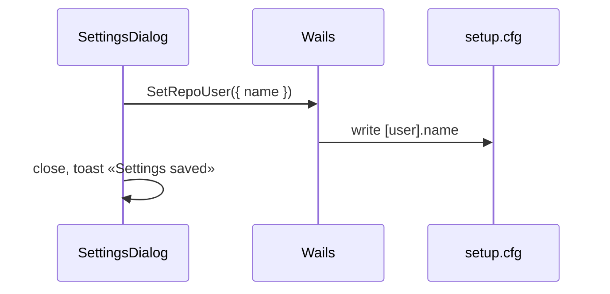

# Settings Dialog

Глобальные настройки приложения. Открывается кнопкой **Settings** на Rail Sidebar.

**Триггер (Rail):** [architecture.md §2.2](./architecture.md) — иконка `Settings` над avatar; одинаково в Project и History ([`4026:4812`](https://www.figma.com/design/Vhp8g306WGBcjSzL4lnl23/?node-id=4026-4812) · [`4026:4547`](https://www.figma.com/design/Vhp8g306WGBcjSzL4lnl23/?node-id=4026-4547)).

**Конфиг:** `~/.dfm/setup.cfg` — [paths.md §2](./paths.md) · [multi-repo.md](./multi-repo.md)

**Связанные:** [create-commit-dialog.md](./create-commit-dialog.md) (author) · [api-contract.md](./api-contract.md) (`GetRepoUser`)

---

## 1. Триггер

Клик **Settings** на Rail → `Dialog` open.

| Источник | Поведение |
|----------|-----------|
| Rail `Settings` | `setSettingsOpen(true)` |
| ESC / Cancel / overlay | close без save (если не dirty) |
| Sidebar collapsed | Rail + Settings **доступны** |

Keyboard (v1.1): `Cmd+,` / `Ctrl+,` → open.

---

## 2. Структура (v1)

> Отдельного Figma-макета dialog пока нет — layout по паттерну [create-commit-dialog.md](./create-commit-dialog.md).

| # | Section | Fields |
|---|---------|--------|
| 1 | Title | `Settings` |
| 2 | **User** | Author name (`[user].name`) |
| 3 | **Repositories** | read-only list из `[repo] path_N` + link «Manage in Sidebar» (v1.1: edit/remove) |
| 4 | Footer | `Cancel` · `Save` |

### 2.1 User

| Field | Source | Validation |
|-------|--------|------------|
| **Author name** | `setup.cfg` `[user].name` | non-empty recommended; used in Create commit + Merge |

`Input` + `Label`. Placeholder: `Your name`.

### 2.2 Repositories (read-only v1)

Краткий список `basename(path)` из `GetKnownRepos()`. Управление репо — через Sidebar dropdown ([multi-repo.md](./multi-repo.md)), не дублировать Add flow здесь.

---

## 3. Save flow



`Save` disabled если форма не изменилась или author пустой (warn inline).

---

## 4. States

| State | UI |
|-------|-----|
| Open | load current `[user].name` |
| Dirty | enable Save |
| Submitting | Save disabled + spinner |
| Error write cfg | toast + keep open |

---

## 5. Corner cases

| Case | Поведение |
|------|-----------|
| `setup.cfg` missing | create on save with `[user]` section |
| Concurrent edit cfg (CLI + GUI) | v1: last-write-wins; v1.1: re-read on open |
| No repos in list | Repositories section: «No repositories yet» |
| Open settings during merge | allowed; не блокировать |
| Rail mode switch while open | dialog stays open (modal) |
| Empty author on save | inline «Author name recommended»; allow save with confirm |

---

## 6. Props

```ts
interface SettingsDialogProps {
  open: boolean
  onOpenChange: (open: boolean) => void
  author: string
  knownRepos: string[]
  onSave: (data: { author: string }) => Promise<void>
}
```

---

## 7. shadcn/ui

`Dialog`, `DialogContent`, `DialogHeader`, `DialogFooter`, `Input`, `Label`, `Button`, `Separator`

---

## 8. Отложено (не v1)

| Тема | Версия |
|------|--------|
| Theme (light/dark) | v2 |
| Blender executable path | v1.1 |
| Edit/remove repos in settings | v1.1 |
| Keyboard shortcut `Cmd+,` | v1.1 |
| Avatar / profile | v2 |
