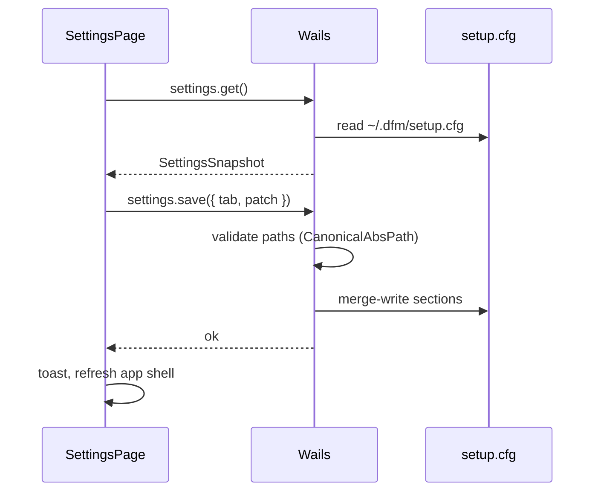

# Settings

Глобальные настройки GUI. Открывается кнопкой **Settings** на Rail Sidebar.

**Figma (shadcn kit):** [`4040:5134`](https://www.figma.com/design/Vhp8g306WGBcjSzL4lnl23/?node-id=4040-5134) — вкладки Profile · **Appearance** · Repositories · External editors · Forester

**Триггер:** [architecture.md §2.2](./architecture.md) — Rail `Settings` ([`4026:4812`](https://www.figma.com/design/Vhp8g306WGBcjSzL4lnl23/?node-id=4026-4812) · [`4026:4547`](https://www.figma.com/design/Vhp8g306WGBcjSzL4lnl23/?node-id=4026-4547))

**Конфиг:** `~/.dfm/setup.cfg` — [paths.md §2](./paths.md) · [multi-repo.md](./multi-repo.md)

**Связанные:** [create-commit-dialog.md](./create-commit-dialog.md) · [merge-dialog.md](./merge-dialog.md) · [api-contract.md](./api-contract.md)

---

## 1. Общий layout

Полноэкранная модалка (не compact `Dialog`):

| Token | Значение |
|-------|----------|
| Width | `~1113px` (`max-w-6xl`) |
| Min height | `~1000px` или `min-h-[80vh]` |
| Padding | `px-10 pt-10 pb-16` |
| Radius | `rounded-xl` |
| Shadow | `shadow-md` |

```
┌──────────────────────────────────────────────────────────── [X]
│ Settings
│ Manage repository and your account settings
│ ─────────────────────────────────────────────────────────────
│ ┌─────────────┬──────────────────────────────────────────────┐
│ │ Profile     │  {Tab title}                                 │
│ │ Appearance  │  {Tab description}                           │
│ │ Repositories│  ─────────────────────────────────────────── │
│ │ External …  │  {fields / list rows}                        │
│ │ Forester    │                                              │
│ │             │  [ Add … ]          [ Save … ]               │
│ └─────────────┴──────────────────────────────────────────────┘
```

**shadcn/ui:** `Dialog` (large `DialogContent`), `Separator`, `Button`, `Input`, `Label`, `Select` / `Combobox`, `AlertDialog` (destructive delete)

### 1.1 Левая навигация

| Property | Spec |
|----------|------|
| Width | `184px` |
| Item height | `40px` |
| Active tab | `bg-accent` (`background/primary/light-hover`) |
| Inactive | transparent + `hover:bg-accent/50` |
| Font | `text-sm font-medium` |

```ts
type SettingsTab =
  | 'profile'
  | 'appearance'
  | 'repositories'
  | 'external-editors'
  | 'forester'
```

**Порядок в nav (Figma):** Profile → Appearance → Repositories → External editors → Forester.

### 1.2 Правая панель

Каждая вкладка:

1. **Title** — `text-lg font-semibold`
2. **Description** — `text-sm text-muted-foreground`
3. `Separator`
4. **Body** — поля или list rows
5. **Actions** — primary `Save …` (+ optional secondary `Add …`)

Кнопки Figma «Upgrade …» в реализации → **Save** (см. §8).

---

## 2. Вкладки и маппинг на Forester

| Tab (Figma) | Назначение для Forester | Хранение |
|-------------|-------------------------|----------|
| **Profile** | Имя автора + язык UI | `setup.cfg` `[user]` · `[gui].language` |
| **Appearance** | Тема и шрифт dashboard | `localStorage` + `[gui]` (см. §4) |
| **Repositories** | Список Forester-репозиториев GUI | `[repo]`, `[current repo]` |
| **External editors** | **Open in external application** | `[gui editors]` |
| **Forester** | Backend: CLI, API, addon, Blender merge | `[forester]`, `[api]`, `[addons]`, `[blender]` |

> **Пять вкладок:** Profile — кто и на каком языке; Appearance — как выглядит GUI; Repositories — что версионируем; External editors — чем открываем файлы; Forester — как вызывается движок.

---

## 3. Profile

**Figma subtitle:** «This is how others will see you on the site.»  
**Forester:** имя в коммитах и merge.

| Field | Figma label | Storage | v1 |
|-------|-------------|---------|-----|
| Author name | Username | `[user].name` | **да** — `Input` |
| Email | — | `[user].email` | v1.1 — optional |
| Language | Language | `[gui].language` | v1: `en` only; combobox ready |

### 3.1 Author name

- Placeholder: `Your name`
- Used by: Create commit, Merge dialog, `commit.create` author field
- Validation: empty → warn «Author name recommended»; save allowed with confirm

### 3.2 Language

Figma: combobox + hint «This is the language that will be used in the dashboard.»

| v1 | `en` only — combobox disabled or single option |
| v2 | `en`, `ru`, … + i18n bundles |

**Primary action:** `Save profile` → write `[user]` + `[gui].language` → toast «Profile saved».

---

## 4. Appearance

**Figma:** [`4040:5530`](https://www.figma.com/design/Vhp8g306WGBcjSzL4lnl23/?node-id=4040-5530) (вкладка внутри `4040:5134`)

**Subtitle:** «Customize the appearance of the app. Automatically switch between day and night themes.»

Визуальные настройки GUI — не влияют на Forester CLI / репозитории. Канон токенов: [design-tokens.md](./design-tokens.md).

### 4.1 Font

| Property | Spec |
|----------|------|
| Label | `Font` |
| Control | `Select` / `Combobox` |
| Hint | «Set the font you want to use in the dashboard.» |
| Max width | `348px` (Figma) |

| Option | v1 | Реализация |
|--------|-----|------------|
| **Inter** | default, единственный | `--font-sans` в `globals.css` |

v1.1: system-ui stack без смены шрифта. v2: доп. шрифты из allowlist.

### 4.2 Theme

| Property | Spec |
|----------|------|
| Section label | `Theme` |
| Hint | «Select the theme for the dashboard.» |
| Layout | `flex gap-6 flex-wrap` — preview cards |

#### Theme preview card (`ThemePreviewCard`)

```
┌─────────────────┐     ┌─────────────────┐
│ ▓▓▓▓▓▓▓▓▓▓▓▓▓▓▓ │     │ ░░░░░░░░░░░░░░░ │
│ (skeleton UI)   │     │ (dark skeleton) │
└─────────────────┘     └─────────────────┘
      Light                   Dark
```

| Property | Light card | Dark card |
|----------|------------|-----------|
| Outer border | `border-2` — selected: `border-ring` (`#a1a1aa`); default: `border-border` (`#d4d4d8`) |
| Inner preview bg | `#e4e4e7` shell + white rows | `#09090b` shell + `#27272a` rows |
| Skeleton pills | light gray on white | `#52525b` on muted |
| Label | `text-sm text-muted-foreground` centered |

**Interaction:** click card → `selectedTheme`; selected card gets `border-ring`. Live preview on select (до Save) — optional v1.1.

| Value | v1 | Описание |
|-------|-----|----------|
| `light` | **да** | shadcn Zinc light — [design-tokens.md](./design-tokens.md) |
| `dark` | **да** | shadcn Zinc dark — `class="dark"` на `<html>` |
| `system` | v1.1 | `prefers-color-scheme`; subtitle Figma про auto day/night |

```ts
// apply on save
document.documentElement.classList.toggle('dark', theme === 'dark')
// system v1.1: matchMedia('(prefers-color-scheme: dark)')
```

### 4.3 Storage

```ini
# ~/.dfm/setup.cfg — optional sync (portable)
[gui]
theme = light
font = inter
language = en
```

```ts
// localStorage — primary for instant apply
'dfm.gui.theme'   // 'light' | 'dark' | 'system'
'dfm.gui.font'    // 'inter'
```

Load order: `localStorage` → fallback `[gui]` in cfg → defaults (`light`, `inter`).

### 4.4 Actions

**Primary:** `Save appearance` → persist → `applyAppearance()` → toast «Appearance saved».

Не путать с Figma «Update Preferences» — в коде **Save appearance**.

---

## 5. Repositories

**Figma subtitle:** «Manage your repository list.»  
Канон управления списком — **здесь**; Sidebar dropdown — быстрый switch + Add ([multi-repo.md](./multi-repo.md) §3).

### 5.1 List row

```
┌──────────────────────────────────────┐ [ Select ] [ 🗑 ]
│ /Users/me/projects/scene-a             │
└──────────────────────────────────────┘
```

| Element | Spec |
|---------|------|
| Path input | read-only display abs path (native OS); `truncate` + tooltip |
| **Select** | `Button outline` — native folder picker → replace row path |
| **Trash** | `Button destructive` 40×40 — `AlertDialog` «Remove from list?» |
| Row validation | Path must be valid Forester repo (`.DFM` exists) on save |

### 5.2 Actions

| Button | Style | Action |
|--------|-------|--------|
| **Add repository** | `secondary` / light bg | folder picker → append `path_N` |
| **Save list** | `default` primary | persist `[repo]`; dedupe `SamePath`; refresh Sidebar |

### 5.3 Правила

- Remove из списка **не удаляет** файлы на диске
- Если удалён **текущий** репо → `[current repo]` → первый в списке или empty
- Dedupe: [paths.md §3](./paths.md) `SamePath`
- Порядок: `path_1`, `path_2`, … по UI order

---

## 6. External editors

**Figma subtitle:** «Manage your editors.»

Приложения для действий GUI **«Open in external application»** ([binary-diff-stub.md](./binary-diff-stub.md), [content-preview-project-view.md §4.4](./content-preview-project-view.md)) — когда нужен явный путь вместо только `xdg-open` / `open`.

### 6.1 Новая секция `setup.cfg`

```ini
[gui editors]
path_1 = /Applications/Blender.app/Contents/MacOS/Blender
path_2 = /usr/local/bin/code
```

| Key | Значение |
|-----|----------|
| `path_N` | Abs path к executable (native OS) |

### 6.2 List row

Тот же паттерн что §5.1: path + **Select** (file picker для `.app`/`.exe`) + **Trash**.

| Button | Action |
|--------|--------|
| **Add application** | append empty row → Select |
| **Save list** | persist `[gui editors]` |

### 6.3 Использование в GUI (v1)

```ts
// workdir.open resolution order:
// 1. extension → first matching editor in [gui editors] (v1.1: explicit map)
// 2. [blender].path if .blend
// 3. OS default (open / xdg-open / ShellExecute)
```

v1 минимум: если `.blend` и задан `[blender].path` → использовать его; иначе OS default. Список `[gui editors]` сохраняется и показывается в UI; routing по расширению — **v1.1**.

### 6.4 Связь с Forester tab

`[blender].path` на вкладке Forester и Blender в External editors — **один путь** в v1.1 (sync). v1: допускается дублирование; при save Forester tab перезаписывает приоритет для `.blend`.

---

## 7. Forester (backend)

**Figma subtitle:** «Manage your repository backend» *(исправлено с typo «you repository»)*.

Пути к toolchain — GUI вызывает Forester через Wails → `jsonapi` → binary из `[forester].path`.

### 7.1 Поля (labeled rows, не anonymous list)

| Label | cfg | Required | Picker |
|-------|-----|----------|--------|
| **Forester CLI** | `[forester].path` | да | file → `forester` / `forester.exe` |
| **API library** | `[api].path` | v1.1 | `.so` / `.dylib` / `.dll` |
| **Blender addon** | `[addons].diffmachine_path` | для merge/objects | folder |
| **Blender executable** | `[blender].path` | для `.blend` open/merge | file |
| **Merge apply script** | `[blender].merge_apply_script` | для object merge v2 | `merge_apply_background.py` |

Каждая строка: `Label` + `Input` (path) + **Select** + optional **Clear** (если optional).

Figma list pattern применяется к **дополнительным** plugin paths (v2):

```ini
[plugins]
blender_enabled = true
```

### 7.2 Validation on save

| Check | Error |
|-------|-------|
| `[forester].path` missing | inline «Forester CLI required» |
| Binary not executable | toast |
| Path not found | inline on row |
| Addon path not a directory | inline |

**Test connection** (v1.1): кнопка «Verify» → `forester --version` subprocess.

**Primary action:** `Save settings` → atomic write cfg sections → toast «Forester settings saved».

---

## 8. Save model

| Tab | Save scope | Close on success |
|-----|------------|------------------|
| Profile | `[user]`, `[gui].language` | stay open |
| Appearance | `localStorage` + `[gui].theme`, `[gui].font` | stay open |
| Repositories | `[repo]` + maybe `[current repo]` | stay open |
| External editors | `[gui editors]` | stay open |
| Forester | `[forester]`, `[api]`, `[addons]`, `[blender]` | stay open |

- **Per-tab Save** — как в Figma (не один global Save)
- Dirty state per tab → enable только активную Save
- ESC / X: если dirty → `AlertDialog` «Discard changes?»



---

## 9. Wails API

| Method | Назначение |
|--------|------------|
| `settings.get` | full snapshot for all tabs |
| `settings.save` | `{ tab, data }` partial write |
| `settings.pickPath` | `{ kind: 'file' \| 'folder' \| 'repo' }` → native dialog |

```ts
interface SettingsSnapshot {
  user: { name: string; email?: string }
  appearance: {
    theme: 'light' | 'dark' | 'system'
    font: 'inter'
  }
  language: string                 // [gui].language
  repos: string[]
  currentRepo: string | null
  editors: string[]
  forester: {
    cliPath: string
    apiPath?: string
    addonPath?: string
    blenderPath?: string
    mergeScriptPath?: string
  }
}
```

`settings.save({ tab: 'appearance', data })` → write storage + вызов `applyAppearance` в frontend.

---

## 10. Corner cases

| Case | Поведение |
|------|-----------|
| `setup.cfg` missing | create minimal on first save |
| Invalid repo path in list | block Save list; highlight row |
| Remove last repo | allow; app → empty state |
| Forester path wrong after save | next API call fails → banner «Forester unavailable» + link Settings |
| Concurrent CLI `config --global` | v1: last-write-wins |
| Open settings during merge | allowed |
| Sidebar collapsed | Rail Settings works |
| Windows paths with spaces | quotes in INI on write |
| Select picker cancelled | no change to row |
| Trash current repo while open | switch to first remaining or empty |
| Theme switch while Settings open | preview applies to modal + app shell |
| Invalid theme in cfg | fallback `light` |
| Dark theme + diff panels | use dark diff colors — [design-tokens.md §3.8](./design-tokens.md) |
| Font change mid-session | re-mount root or CSS var swap; no reload v1.1 |

---

## 11. MVP scope (v1)

| Tab | v1 |
|-----|-----|
| Profile | **Author name** + Language (`en` only) |
| Appearance | **Theme** Light/Dark cards + **Font** Inter (read-only) |
| Repositories | **full list** add/remove/save |
| External editors | list UI + save; routing `.blend` → `[blender].path` |
| Forester | **Forester CLI** + **Blender** + **addon path** |

Отложено: `system` theme, extra fonts, email, API lib picker, merge script, extension→editor map, Verify button.

---

## 12. Компоненты (React)

```
frontend/src/components/settings/
  SettingsDialog.tsx
  SettingsProfileTab.tsx
  SettingsAppearanceTab.tsx
  ThemePreviewCard.tsx
  SettingsRepositoriesTab.tsx
  SettingsEditorsTab.tsx
  SettingsForesterTab.tsx
  SettingsPathRow.tsx
  settingsStore.ts
  applyAppearance.ts
```

---

## 13. Решения (закрытые)

| # | Тема | Решение |
|---|------|---------|
| 1 | Layout | Full-width modal по Figma `4040:5134` |
| 2 | Appearance vs Profile | Language → Profile; theme/font → Appearance |
| 3 | Theme UI | Preview cards Light/Dark — Figma `4040:5611` |
| 4 | Theme storage | `localStorage` primary; `[gui]` в cfg для sync |
| 5 | Repositories CRUD | Settings — канон списка |
| 6 | Figma «Upgrade …» | → **Save profile / Save appearance / Save list / …** |
| 7 | Forester tab | Labeled backend fields |
| 8 | cfg source | `~/.dfm/setup.cfg` + `localStorage` для appearance |
