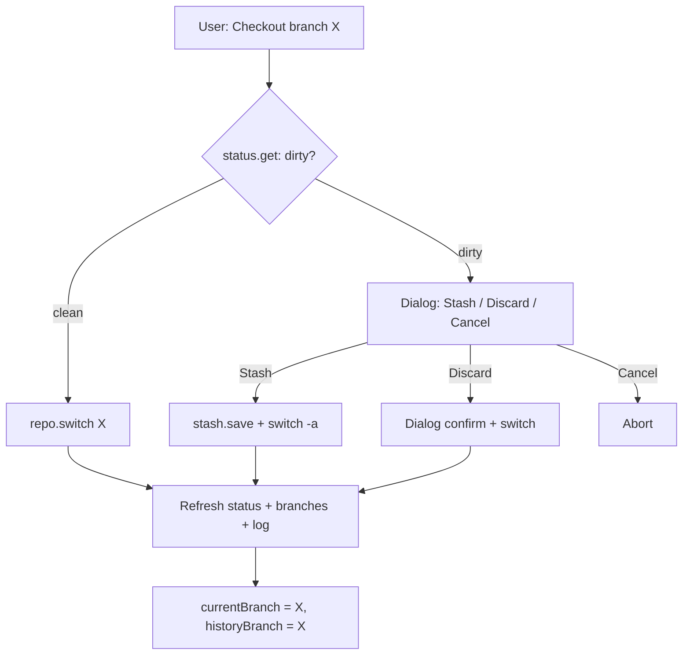

# Sidebar — History view

Режим просмотра **веток и коммитов**.  
**Figma (shadcn kit):** [Sidebar/History `4026:4547`](https://www.figma.com/design/Vhp8g306WGBcjSzL4lnl23/?node-id=4026-4547)

**Цвета:** [design-tokens.md](./design-tokens.md)

**API:** [api-contract.md](./api-contract.md)

## 1. Назначение

Пользователь выбирает **ветку**, просматривает **линейный список коммитов**, фильтрует поиском и выбирает коммит для просмотра в Content Preview / Info.

**Не в scope v1 Sidebar:** checkout (`repo.switch`), создание/удаление веток, merge — только навигация и selection.

---

## 2. Анатомия UI

```
┌─────────────────────────────────────┐
│ History                             │
├─────────────────────────────────────┤
│ [⑂] Branch name              [⇕]    │
│ [ Type to search...           ]     │
├─────────────────────────────────────┤
│ ┌───────────────────────────────┐ ⋮   │
│ │ ⑂ [⎇] Commit message       │     │
│ │ Author                        │     │
│ │ Description: Thank you…       │     │
│ │ 7 files changed  +12  -12     │     │
│ │ [1w ago] [Tag]                │     │
│ └───────────────────────────────┘     │
│ ┌─────────────────────────────┐ ⋮   │
│ │ ...                         │     │
│ └─────────────────────────────┘     │
└─────────────────────────────────────┘
```

Список коммитов — **карточки** с gap `8px`, не разделители `border-b`.  
**Figma (shadcn kit):** [4026:4547](https://www.figma.com/design/Vhp8g306WGBcjSzL4lnl23/?node-id=4026-4547) · [Commit card `4032:4194`](https://www.figma.com/design/Vhp8g306WGBcjSzL4lnl23/?node-id=4032-4194) · [commit-card.md](./commit-card.md)

### 2.1 Header

- Только заголовок `History` (semibold 16px).
- Без toggle «Changed» — он относится только к Project view.

### 2.2 Branch selector

- Icon `GitBranch`, label = имя **просматриваемой** ветки (`historyBranch`).
- Dropdown — см. §2.6 (browse vs checkout).
- Фон: `bg-background` (white) + border.

**Важно:** `historyBranch` (что смотрим в log) и `currentBranch` (на какой ветке рабочая копия) — **разные поля**. Они совпадают после checkout, но могут расходиться при «browse without checkout».

### 2.3 Commit list (scroll area)

- Container `7311:19033`: **`bg-background` (white)**, `border-r`, vertical scroll.
- Карточки коммитов на белом фоне, gap `8px`, padding `8px`.
- См. [architecture.md §2.4](./architecture.md) · [commit-card.md](./commit-card.md).

### 2.4 Цвета (List Container)

См. [design-tokens.md §3.1](./design-tokens.md).

| Элемент | Figma token | Tailwind |
|---------|-------------|----------|
| Shell Sidebar | `background/primary/light` | `bg-sidebar` |
| List Container | `background/default` | `bg-background` |
| Branch selector | `background/default` | `bg-background border-border` |
| Search input | `background/default` | `bg-background border-input` |
| Commit card Default | `background/default` | `bg-background border-border` |

### 2.6 Branch selector: browse vs checkout

В Git-клиентах два разных намерения:

| Намерение | Пример | Меняет рабочую капию? |
|-----------|--------|------------------------|
| **Browse** | «Покажи коммиты `feature/ui`» | Нет |
| **Checkout** | «Переключи проект на `feature/ui`» | Да (`forester switch`) |

#### Рекомендуемая модель для v1

**Dropdown = только browse.** Выбор ветки в списке:

1. Устанавливает `historyBranch`.
2. Загружает `log.get` для этой ветки.
3. **Не** вызывает `repo.switch`.
4. Индикатор в dropdown: `is_current` → иконка/check «это текущая ветка WC».

**Checkout — отдельное явное действие**, чтобы не перезаписать несохранённые изменения случайным кликом.

#### Где делать checkout

| Место | UX |
|-------|-----|
| **Строка ветки в dropdown** | Secondary action: иконка `GitBranch` + «Checkout» справа, или submenu |
| **Контекстное меню** | Right-click на ветке в dropdown → «Checkout branch» |
| **Кнопка в header** (v1.1) | Если `historyBranch !== currentBranch` → outlined button «Checkout this branch» |

#### Flow checkout



**Dirty** = любой непустой массив в `status.get` (staged/unstaged/untracked) или merge in progress.

#### Диалог при dirty tree

```
Switch branch to "feature/ui"?

You have uncommitted changes:
• 3 modified
• 1 untracked

[ Cancel ]  [ Stash & switch ]  [ Switch anyway ]
```

- **Stash & switch** → `repo.switch` с `auto_stash: true` (Forester `-a`).
- **Switch anyway** → обычный `repo.switch` (может fail — показать error от Forester).
- После успеха: обновить Project view + History; `historyBranch` = новая current.

#### Когда browse без checkout полезен

- Сравнить историю `main` и `feature`, оставаясь на feature.
- Посмотреть коммиты релизной ветки, не переключая рабочую копию.
- Code review: листать чужую ветку.

#### Визуальные индикаторы

| Состояние | UI |
|-----------|-----|
| `historyBranch === currentBranch` | Branch label normal; check в dropdown |
| `historyBranch !== currentBranch` | Muted subtitle под selector: «Viewing · not checked out» или dot badge |
| Merge in progress | Banner над list: «Merge in progress»; checkout disabled |
| Detached HEAD (v2) | «(detached)» в label |

#### Corner cases checkout

| Ситуация | Поведение |
|----------|-----------|
| Checkout на ту же ветку | No-op + toast «Already on branch X» |
| Checkout при merge in progress | Block; suggest `merge --continue` / `--abort` |
| Switch fail (Forester error) | Toast + не менять `currentBranch` |
| После checkout log другой ветки | Опционально: auto-set `historyBranch = currentBranch` (настраиваемо) |
| User browsed branch B, then checkout B | `historyBranch` уже B — без скачка списка |

#### Альтернатива (не рекомендуется для v1)

**Dropdown сразу делает checkout** — как в простых GUI. Минус: каждый просмотр log другой ветки перезаписывает WC; нужен confirm на каждый клик → раздражает. Имеет смысл только если History = «список веток проекта», а не «просмотр истории».

### 2.3 Search

- Placeholder: `Type to search...`
- Фильтрация **клиентская** по уже загруженному log.
- Поля поиска: `message`, `author`, `hash` (prefix), `description` если появится в API.

Debounce: 150ms.

### 2.4 Commit card

Полная спека компонента: **[commit-card.md](./commit-card.md)** (layout, состояния Default/Hover/Selected, данные, menu).

Кратко: карточка `269px`, gap `8px` в списке; клик → select commit; ⋮ → context menu.

## 3. Data flow

```mermaid
sequenceDiagram
  participant UI as HistoryViewPanel
  participant W as Wails Go
  participant F as Forester jsonapi

  UI->>W: ForesterCall branch.list
  W->>F: branch.list
  F-->>W: branches[]
  W-->>UI: branches

  UI->>UI: historyBranch ||= current from is_current

  UI->>W: ForesterCall log.get
  W->>F: log.get
  W-->>UI: commits[]

  Note over UI: client filter by search; stats from log fields or diff.stat lazy

  UI->>W: ForesterCall commit.get [on select, optional]
  W->>F: commit.get
```

### 3.1 API payloads

**`branch.list`**

```json
{
  "branches": [
    { "name": "main", "commit_hash": "abc…", "created_at": 0, "is_current": true }
  ]
}
```

**`log.get`** args: `{ "branch": "main", "max_count": 100 }`

```json
{
  "commits": [
    {
      "hash": "…",
      "parent_hash": "…",
      "parent_hashes": ["…"],
      "author": "Name",
      "message": "Comment message",
      "timestamp": 1710000000,
      "tags": ["v1.0"],
      "files_added": 12,
      "files_removed": 12
    }
  ]
}
```

Default `max_count`: 100. Поля `tags`, `files_added`, `files_removed` — **расширение API** (§2.4.3–2.4.4).

---

## 4. Состояние History view

```ts
interface HistoryViewState {
  branches: Branch[]
  historyBranch: string
  commits: Commit[]
  filteredCommits: Commit[]
  searchQuery: string
  selectedCommitHash: string | null
  loadingBranches: boolean
  loadingLog: boolean
  error: string | null
}
```

### 4.1 Инициализация

1. Load branches.
2. `historyBranch` = saved per-repo OR branch where `is_current === true` OR `"main"`.
3. Load log for `historyBranch`.
4. Select first commit **не** автоматически (избегаем лишних preview loads) — только если был saved selection.

---

## 5. Corner cases

### 5.1 Нет веток (не должно случиться)

- Forester всегда создаёт `main` при init.
- Fallback: empty + error «No branches».

### 5.2 Ветка без коммитов

- `commit_hash === ""` в branch.list.
- Log → `commits: []`.
- Empty: «No commits on this branch».

### 5.3 `historyBranch` удалена извне

- После refresh branch отсутствует в list.
- Fallback на `is_current` branch + toast.

### 5.4 Detached HEAD

- `branch.list`: одна ветка `is_current`, но HEAD может не совпадать с branch tip (если Forester такое поддерживает).
- Показать indicator в branch selector «detached» — если API отдаёт; иначе v2.

### 5.5 Merge commit

- `GitMerge` 16px в header (§2.4).

### 5.6 Head indicator

- `GitBranch` 16×16 + `Tooltip` «Branch tip (HEAD)» — **icon only** (как [commit-card.md](./commit-card.md), [design-tokens.md §3.4](./design-tokens.md)); только tip ветки.

### 5.6a No description

- Строка description в карточке **не рендерится** (см. [commit-card.md §2.3](./commit-card.md)).

### 5.6b Files stats loading

- Skeleton `+ – − –` в footer; hide after error.

### 5.6c No tag

- Tag Badge не рендерится; footer сжимается.

### 5.7 Очень длинное message

- Title: 1 строка truncate; description: `line-clamp-2`.

### 5.7a Клик ⋮

- `stopPropagation`; destructive → `AlertDialog`; Revert disabled для HEAD.

### 5.8 Date / tooltip

- Relative на badge; absolute в `Tooltip`.

### 5.9 Поиск без результатов

- Inline empty: «No commits match "query"».
- Clear search button в Input.

### 5.10 Log loading при быстрой смене ветки

- Cancel stale responses; skeleton на list.

### 5.11 Selected commit исчез из log

- После refresh / смены branch: если hash не в list → clear selection.

### 5.12 Тысячи коммитов

- v1: cap 100 + hint «Showing latest 100 commits».
- v2: infinite scroll + `log.get` offset/cursor (требует API).

### 5.13 Unicode / emoji в message

- Normal UTF-8 display; search case-insensitive locale-aware.

### 5.14 Concurrent new commit

- Polling log при focus (optional, реже чем status).
- Новый commit появляется сверху; selection не меняется.

### 5.15 Branch selector: только одна ветка

- Dropdown всё равно кликабелен (для future create branch).

---

## 6. Компоненты (React)

| Component | Responsibility |
|-----------|----------------|
| `HistoryViewPanel` | Orchestration |
| `HistoryHeader` | Title |
| `BranchSelector` | Dropdown + load branches |
| `CommitSearch` | Controlled Input |
| `CommitList` | `ScrollArea`, gap `space-2`, padding `px-2` |
| `CommitCard` | Card layout §2.4; states Default/Hover/Selected |
| `CommitCardMenu` | `DropdownMenu` on `MoreVertical` §2.4.6 |
| `CommitCardStats` | Files Changed +/− |

### Keyboard

- `↑` / `↓` — move selection in filtered list.
- `Enter` — confirm selection.
- `/` — focus search (optional).

---

## 7. Отличия от Project view

| | Project view | History view |
|---|-------------|--------------|
| Rail icon active | `FolderGit2` | `GitFork` |
| Header extra | Changed Switch | — |
| Context dropdown | Repo name | Branch name |
| List content | Folders / changed files | Commits |
| Primary API | `status.get`, `workdir.tree` | `branch.list`, `log.get`, `commit.get`, `diff.*` |
| Selection type | `ProjectViewContext` (folder) | `commit` |

При переключении rail Project ↔ History: **сброс selection** (см. [architecture.md](./architecture.md) §6.10).

---

## 8. Решения и открытые вопросы

| # | Тема | Решение |
|---|------|---------|
| 1 | Branch dropdown | **Browse log only** — `historyBranch` + `log.get`; checkout отдельно (§2.5) |
| 2 | Commit card | [commit-card.md](./commit-card.md) |
| 3 | Head | `GitBranch` 16×16 icon + Tooltip — **icon only**, без pill ([design-tokens.md §3.4](./design-tokens.md)) |
| 4 | API extensions | `tags`, `files_added`/`files_removed` в log |
| 5 | Auto-select commit | **Нет** (в Sidebar); Content Preview auto-select **первый файл** при выборе коммита — [content-preview-history-view.md](./content-preview-history-view.md) |
| 6 | Content Preview | [content-preview-history-view.md](./content-preview-history-view.md); atoms: [preview-commit-header.md](./preview-commit-header.md) · [history-changed-file-item.md](./history-changed-file-item.md) · [diff-view.md](./diff-view.md) + diff panels |
