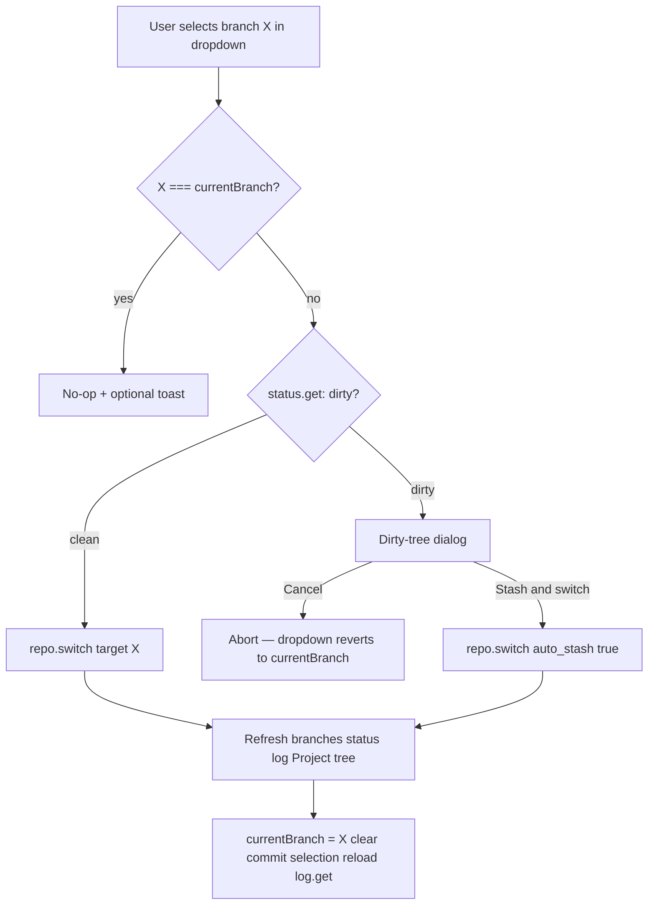

# Sidebar — History view

Режим просмотра **веток и коммитов**.  
**Figma (shadcn kit):** [Sidebar/History `4026:4547`](https://www.figma.com/design/Vhp8g306WGBcjSzL4lnl23/?node-id=4026-4547)

**Цвета:** [design-tokens.md](./design-tokens.md)

**API:** [api-contract.md](./api-contract.md)

**Решения v1.0:** [decisions.md §6–§8](./decisions.md) — commit card menu, selection, dirty switch.

**Rail (общий):** [architecture.md §2.2](./architecture.md) — **Settings** → [settings-dialog.md](./settings-dialog.md). Figma: [`4026:4547`](https://www.figma.com/design/Vhp8g306WGBcjSzL4lnl23/?node-id=4026-4547).

## 1. Назначение

Пользователь переключает **текущую ветку** (как GitHub Desktop), просматривает **линейный список коммитов** этой ветки, фильтрует поиском и выбирает коммит для просмотра в Content Preview.

**UX-ориентир:** GitHub Desktop — branch dropdown = checkout; History log всегда для **текущей** ветки (`currentBranch`).

**Не в scope v1 Sidebar:** удаление веток. **Создание ветки** — dropdown + [create-branch-dialog.md](./create-branch-dialog.md). **Merge** — v2: [merge-dialog.md](./merge-dialog.md).

---

## 2. Анатомия UI

```
┌─────────────────────────────────────┐
│ History                             │
├─────────────────────────────────────┤
│ [⑂] Branch name              [⇕]    │
│ [ Type to search...           ]     │
├─────────────────────────────────────┤
│ ┌───────────────────────────────┐ ⋮   │
│ │ ⑂ [⎇] Commit message       │     │
│ │ Author                        │     │
│ │ Description: Thank you…       │     │
│ │ 7 files changed  +12  -12     │     │
│ │ [1w ago] [Tag]                │     │
│ └───────────────────────────────┘     │
│ ┌─────────────────────────────┐ ⋮   │
│ │ ...                         │     │
│ └─────────────────────────────┘     │
└─────────────────────────────────────┘
```

Список коммитов — **карточки** с gap `8px`, не разделители `border-b`.  
**Figma (shadcn kit):** [4026:4547](https://www.figma.com/design/Vhp8g306WGBcjSzL4lnl23/?node-id=4026-4547) · [Commit card `4032:4194`](https://www.figma.com/design/Vhp8g306WGBcjSzL4lnl23/?node-id=4032-4194) · [commit-card.md](./commit-card.md)

### 2.1 Header

- Только заголовок `History` (semibold 16px).
- Без toggle «Changed» — он относится только к Project view.

### 2.2 Branch selector

- Icon `GitBranch`, label = **`currentBranch`** (ветка рабочей копии и History log).
- Dropdown — `Popover` + список веток (checkmark у текущей); паттерн как `RepoSelector` в Project view.
- Footer: `Separator` + **Create new branch…** (`Plus`) → [create-branch-dialog.md](./create-branch-dialog.md).
- Фон: `bg-background` (white) + border.
- Общий компонент `BranchSelector` — в History он в context slot Sidebar; checkout on select — §2.6.

**Важно:** отдельного поля `historyBranch` **нет**. `log.get({ branch: currentBranch })`. Исключение: **file history** в Content Info ([info-history-section.md](./info-history-section.md)) — read-only filter ветки для `log.get`+`path`, без checkout.

### 2.3 Commit list (scroll area)

- Container `7311:19033`: **`bg-background` (white)**, vertical scroll (без `border-r` — правая граница только на shell Sidebar).
- Карточки коммитов на белом фоне, gap `8px`, padding `8px`.
- См. [architecture.md §2.4](./architecture.md) · [commit-card.md](./commit-card.md).

### 2.4 Цвета (List Container)

См. [design-tokens.md §3.1](./design-tokens.md).

| Элемент | Figma token | Tailwind |
|---------|-------------|----------|
| Shell Sidebar | `background/primary/light` | `bg-sidebar` |
| List Container | `background/default` | `bg-background` |
| Branch selector | `background/default` | `bg-background border-border` |
| Search input | `background/default` | `bg-background border-input` |
| Commit card Default | `background/default` | `bg-background border-border` |

### 2.6 Branch selector (GitHub Desktop model)

**Модель v1:** выбор ветки в dropdown **сразу переключает рабочую копию** (как **Current Branch** в GitHub Desktop). Отдельного «browse log без checkout» в History Sidebar **нет**.

#### Flow при выборе ветки X



> v1.0: только Cancel + Stash & switch — [decisions.md §8.2](./decisions.md). **Try anyway** не в UI (Forester отклоняет dirty switch без stash).

**Dirty** = любой непустой массив в `status.get` (staged/unstaged/untracked) или merge in progress.

#### Диалог при dirty tree

Макет: [dirty-branch-switch-dialog.md](./dirty-branch-switch-dialog.md) · Figma [`4040:8317`](https://www.figma.com/design/Vhp8g306WGBcjSzL4lnl23/?node-id=4040-8317)

```
Switch branch to "feature/ui"?

You have uncommitted changes:
• 3 modified
• 1 untracked

[ Cancel ]  [ Stash & switch ]
```

| Кнопка | API | Примечание |
|--------|-----|------------|
| **Cancel** | — | Dropdown возвращает label к `currentBranch` |
| **Stash & switch** | `repo.switch({ target, auto_stash: true })` | Forester `-a` |
| **Discard & switch** | v1.1 | Требует `workdir.discard` / reset index — API пока нет |

**Try anyway** — **не в v1.0** ([decisions.md §8.2](./decisions.md)). Forester отклоняет `repo.switch` без stash при dirty tree.

После успешного switch:

1. `currentBranch = X`
2. `log.get({ branch: X })` — новый список коммитов
3. Сброс `selectedCommitHash` → Preview empty
4. Refresh Project view (`status.get`, `workdir.tree`)

#### Визуальные индикаторы

| Состояние | UI |
|-----------|-----|
| Текущая ветка | Label = `currentBranch`; checkmark у активной строки в dropdown |
| Merge in progress | Banner над list: «Merge in progress» + **Review merge** → [merge-dialog.md](./merge-dialog.md); branch switch disabled |
| Detached HEAD (v2) | «(detached)» в label |
| Switch in progress | Dropdown disabled + spinner |

#### Corner cases

| Ситуация | Поведение |
|----------|-----------|
| Select та же ветка | No-op; optional toast «Already on branch X» |
| Switch при merge in progress | Block; suggest merge continue/abort (v2) |
| Switch fail (Forester error) | Toast; `currentBranch` и dropdown **не** менять |
| Быстрая смена веток | Cancel stale `log.get`; skeleton на list |
| CLI switch извне | Refresh `branch.list`; обновить label и log |
| Единственная ветка | Dropdown кликабелен; **Create new branch…** доступен |
| Create branch | Dialog → `branch.create`; refresh list; **не** checkout |
| Duplicate / invalid name | Error toast; dialog остаётся open |

#### File history (исключение)

В **Content Info → History** ([info-history-section.md](./info-history-section.md)) branch picker **только фильтрует** `log.get`+`path` для выбранного файла — **не** вызывает `repo.switch`. Визуал — тот же `DropdownSelector`, что в Sidebar ([design-tokens.md §4.5](./design-tokens.md)). Это не противоречит GHD-модели глобального branch selector.

### 2.3 Search

- Placeholder: `Type to search...`
- Фильтрация **клиентская** по уже загруженному log.
- Поля поиска: `message`, `author`, `hash` (prefix), `description` если появится в API.

Debounce: 150ms.

### 2.4 Commit card

Полная спека компонента: **[commit-card.md](./commit-card.md)** (layout, состояния Default/Hover/Selected, данные, menu).

Кратко: карточка `269px`, gap `8px` в списке; клик → select commit; ⋮ → context menu.

## 3. Data flow

```mermaid
sequenceDiagram
  participant UI as HistoryViewPanel
  participant W as Wails Go
  participant F as Forester jsonapi

  UI->>W: ForesterCall branch.list
  W->>F: branch.list
  F-->>W: branches[]
  W-->>UI: branches

  UI->>UI: currentBranch from is_current or branch.list

  UI->>W: ForesterCall log.get branch currentBranch
  W->>F: log.get
  W-->>UI: commits[]

  Note over UI: client filter by search; stats from log fields or diff.stat lazy

  UI->>W: ForesterCall commit.get [on select, optional]
  W->>F: commit.get
```

### 3.1 API payloads

**`branch.list`**

```json
{
  "branches": [
    { "name": "main", "commit_hash": "abc…", "created_at": 0, "is_current": true }
  ]
}
```

**`log.get`** args: `{ "branch": "main", "max_count": 100 }`

```json
{
  "commits": [
    {
      "hash": "…",
      "parent_hash": "…",
      "parent_hashes": ["…"],
      "author": "Name",
      "message": "Comment message",
      "timestamp": 1710000000,
      "tags": ["v1.0"],
      "files_added": 12,
      "files_removed": 12
    }
  ]
}
```

Default `max_count`: 100. Поля `tags`, `files_added`, `files_removed` — **расширение API** (§2.4.3–2.4.4).

---

## 4. Состояние History view

```ts
interface HistoryViewState {
  branches: Branch[]
  // currentBranch — shared SidebarState (architecture.md §3)
  commits: Commit[]
  filteredCommits: Commit[]
  searchQuery: string
  selectedCommitHash: string | null
  loadingBranches: boolean
  loadingLog: boolean
  switchingBranch: boolean
  error: string | null
}
```

### 4.1 Инициализация и вход в History

1. Load `branch.list`.
2. `currentBranch` = branch where `is_current === true` OR `"main"`.
3. `log.get({ branch: currentBranch })`.
4. **Auto-select commit** после загрузки log (§4.2):
   - если есть сохранённый `dfm.history.selectedCommitHash` и hash в log → выбрать его;
   - иначе → **первый коммит в списке** (новейший, верх списка);
   - карточка коммита в Sidebar — состояние **Selected**; Content Preview загружает diff.

### 4.2 Вход через Rail (Project → History)

При клике **History** на Rail:

1. Сброс **только** Project file selection (`PreviewSelection`).
2. **Не** сбрасывать commit selection заранее — после `log.get` сработает §4.1.
3. Content Preview: для выбранного коммита **auto-select первый changed file** A→Z и показать diff — [content-preview-history-view.md §4.1](./content-preview-history-view.md).

При уходе **History → Project**: сброс `selectedCommitHash` (commit selection).

---

## 5. Corner cases

### 5.1 Нет веток (не должно случиться)

- Forester всегда создаёт `main` при init.
- Fallback: empty + error «No branches».

### 5.2 Ветка без коммитов

- `commit_hash === ""` в branch.list.
- Log → `commits: []`.
- Empty: «No commits on this branch».

### 5.3 `currentBranch` отсутствует в branch.list

- После refresh имя не найдено (ветка удалена извне).
- Fallback на `is_current` branch + toast.

### 5.4 Detached HEAD

- `branch.list`: одна ветка `is_current`, но HEAD может не совпадать с branch tip (если Forester такое поддерживает).
- Показать indicator в branch selector «detached» — если API отдаёт; иначе v2.

### 5.5 Merge commit

- `GitMerge` 16px в header (§2.4).

### 5.6 Head indicator

- `GitBranch` 16×16 + `Tooltip` «Branch tip (HEAD)» — **icon only** (как [commit-card.md](./commit-card.md), [design-tokens.md §3.4](./design-tokens.md)); только tip ветки.

### 5.6a No description

- Строка description в карточке **не рендерится** (см. [commit-card.md §2.3](./commit-card.md)).

### 5.6b Files stats loading

- Skeleton `+ – − –` в footer; hide after error.

### 5.6c No tag

- Tag Badge не рендерится; footer сжимается.

### 5.7 Очень длинное message

- Title: 1 строка truncate; description: `line-clamp-2`.

### 5.7a Клик ⋮

- `stopPropagation`; destructive → `AlertDialog`; Revert disabled для HEAD.

### 5.8 Date / tooltip

- Relative на badge; absolute в `Tooltip`.

### 5.9 Поиск без результатов

- Inline empty: «No commits match "query"».
- Clear search button в Input.

### 5.10 Log loading при быстрой смене ветки

- Cancel stale responses; skeleton на list.

### 5.11 Selected commit исчез из log

- После refresh / смены branch: если hash не в list → clear selection.

### 5.12 Тысячи коммитов

- v1: cap 100 + hint «Showing latest 100 commits».
- v2: infinite scroll + `log.get` offset/cursor (требует API).

### 5.13 Unicode / emoji в message

- Normal UTF-8 display; search case-insensitive locale-aware.

### 5.14 Concurrent new commit

- Polling log при focus (optional, реже чем status).
- Новый commit появляется сверху; selection не меняется.

### 5.15 Branch selector: только одна ветка

- Dropdown кликабелен; **Create new branch…** в footer (§2.2).

### 5.16 Create branch

- Триггер: **Create new branch…** в dropdown.
- Dialog: [create-branch-dialog.md](./create-branch-dialog.md).
- API: `branch.create({ name })` — tip = HEAD `currentBranch`.
- Успех: toast + refresh `branch.list`; **не** switch на новую ветку.
- Checkout новой ветки — отдельный выбор в dropdown (§2.6, dirty dialog при необходимости).

---

## 6. Компоненты (React)

| Component | Responsibility |
|-----------|----------------|
| `HistoryViewPanel` | Orchestration |
| `HistoryHeader` | Title |
| `BranchSelector` | Popover + branch list + **Create new branch…**; checkout flow §2.6 |
| `CreateBranchDialog` | [create-branch-dialog.md](./create-branch-dialog.md) |
| `CommitSearch` | Controlled Input |
| `CommitList` | `ScrollArea`, gap `space-2`, padding `px-2` |
| `CommitCard` | Card layout §2.4; states Default/Hover/Selected |
| `CommitCardMenu` | `DropdownMenu` on `MoreVertical` §2.4.6 |
| `CommitCardStats` | Files Changed +/− |

### Keyboard

- `↑` / `↓` — move selection in filtered list.
- `Enter` — confirm selection.
- `/` — focus search (optional).

---

## 7. Отличия от Project view

| | Project view | History view |
|---|-------------|--------------|
| Rail icon active | `FolderGit2` | `GitFork` |
| Header extra | Changed Switch | — |
| Context dropdown | Repo name | `currentBranch` (checkout on select) |
| List content | Folders / changed files | Commits |
| Primary API | `status.get`, `workdir.tree` | `branch.list`, `log.get`, `commit.get`, `diff.*` |
| Selection type | `ProjectViewContext` (folder) | `commit` |

При переключении rail Project ↔ History: сброс **file** selection; commit selection сбрасывается только при **уходе** из History (см. [architecture.md](./architecture.md) §6.10).

---

## 8. Решения и открытые вопросы

| # | Тема | Решение |
|---|------|---------|
| 1 | Branch dropdown | **GitHub Desktop** — checkout on select; log = `currentBranch` (§2.6); create — §2.2 / [create-branch-dialog.md](./create-branch-dialog.md) |
| 2 | Commit card | [commit-card.md](./commit-card.md) |
| 3 | Head | `GitBranch` 16×16 icon + Tooltip — **icon only**, без pill ([design-tokens.md §3.4](./design-tokens.md)) |
| 4 | API extensions | `tags`, `files_added`/`files_removed` в log |
| 5 | Auto-select commit | **Да** при входе в History / после `log.get`: saved hash или **первый** в log; Content Preview — **первый файл** A→Z — [content-preview-history-view.md §4.1](./content-preview-history-view.md) |
| 6 | Content Preview | [content-preview-history-view.md](./content-preview-history-view.md); atoms: [preview-commit-header.md](./preview-commit-header.md) · [history-changed-file-item.md](./history-changed-file-item.md) · [diff-view.md](./diff-view.md) + diff panels |
