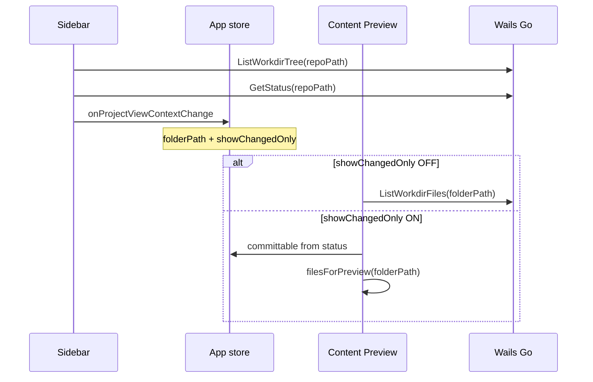

# Sidebar — Project view

Режим просмотра **структуры папок** рабочей директории репозитория.  
**Figma (shadcn kit):** [Sidebar/Files `4026:4812`](https://www.figma.com/design/Vhp8g306WGBcjSzL4lnl23/?node-id=4026-4812)

**Цвета:** [design-tokens.md](./design-tokens.md)

---

## 1. Назначение

Sidebar показывает **только папки** в виде **полностью раскрытого дерева**. Файлы в Sidebar **не отображаются** — их список и просмотр в **Content Preview** (отдельная панель).

| Зона | Что показывает |
|------|----------------|
| **Sidebar (Project view)** | Дерево папок + count badge |
| **Content Preview** | Файлы выбранной папки, preview, diff |

Выбор папки в Sidebar → `{ kind: 'folder', path }` (`path: ''` = **корень репо**) → Content Preview загружает файлы этой папки.

Toggle **Changed** одновременно:
1. Фильтрует дерево папок в Sidebar (только ветки с изменениями).
2. Сигнализирует Content Preview показывать **только committable** файлы (§3).

---

## 2. Анатомия UI

```
┌─────────────────────────────────────┐
│ Project view          Changed [○]   │
├─────────────────────────────────────┤
│ [📁] Project name            [⇕]    │
├─────────────────────────────────────┤
│ FOLDERS                             │
│ ▼ [📁] assets                 120   │
│     ▼ [📁] References         972   │
│         [📁] chars             12   │
│     [📁] Textures              56   │
│ [📁] scenes                     3   │
│         (scroll)                    │
└─────────────────────────────────────┘
```

### 2.1 Header

| Элемент | Поведение |
|---------|-----------|
| Title `Project view` | Статичный label |
| Label `Changed` | Подпись к Switch |
| Switch | Фильтр дерева папок **и** режим списка файлов в Preview (§3) |

### 2.2 Repo selector

- Иконка `FolderGit2`, текст = `repoName`.
- Dropdown: Open repository, Recent, (v2) Reveal in Finder.
- Фон: `bg-background` (white) + border.

### 2.3 Дерево папок (v1) — **зафиксировано**

**Решения:**

| # | Решение |
|---|---------|
| Содержимое | **Только папки**, файлы не рендерятся |
| Layout | **Tree**, не drill-down |
| Раскрытие | **Always expanded** — collapse узлов отключён в v1 |
| Root | **Selectable** — `path: ''` → Preview показывает файлы корня репо |

#### Визуал строки папки

- Отступ по глубине (`paddingLeft = depth * indent`).
- Chevron `ChevronDown` (декоративный в v1 — все узлы expanded) или без chevron.
- Icon `Folder`.
- Name (`text-sm/medium`, `foreground/secondary`).
- Count badge справа (`text-xs/semibold`).
- **Default:** прозрачный фон на белом Container.
- **Hover / Selected:** `bg-sidebar rounded-sm` (Figma `background/primary/light`)

#### Клик по папке / root

- Highlight row (`selected`).
- `path: ''` — **корень репозитория**; Preview показывает файлы непосредственно в root (без подпапок).
- `path: 'assets/References'` — Preview показывает immediate files этой папки.
- Emit `onProjectViewContextChange` (§3.3) при каждом изменении folder или toggle.

#### Папки без файлов (только подпапки)

- Показываются в дереве как обычно.
- `item_count` может быть > 0 (считаются вложенные папки + файлы в поддереве).
- Клик → Preview: empty state «No files in this folder» (только подпапки есть).

#### Сворачивание (collapse)

- **v1: always expanded** — пользователь не может свернуть узлы; chevron декоративный или отсутствует.
- Collapse per-node — не раньше v2.

#### Производительность

При большом числе папок (>500 nodes):

- Обязательна **`@tanstack/react-virtual`** на flat list (DFS flatten expanded tree).
- Backend: один вызов `ListWorkdirTree` при open repo + invalidate on refresh.
- Skeleton при первой загрузке.

### 2.4 Цвета (List Container)

См. [design-tokens.md §3.1](./design-tokens.md).

| Элемент | Figma token | Tailwind |
|---------|-------------|----------|
| Shell Sidebar | `background/primary/light` | `bg-sidebar` |
| List Container | `background/default` | `bg-background` |
| Repo selector | `background/default` | `bg-background border-border` |
| Folder row Default | — | transparent |
| Folder row Selected | `background/primary/light` | `bg-sidebar rounded-sm` |

---

## 3. Режим «Changed» (Switch ON) — **зафиксировано**

Toggle влияет на **две панели одновременно**: Sidebar и Content Preview.

### 3.1 Sidebar: фильтр дерева папок

Показывать только папки, в поддереве которых есть хотя бы один **committable** файл (§3.2):

- Родительские папки сохраняются (prune пустых веток).
- Дерево остаётся **always expanded**.
- Badge (опционально v1.1): число committable файлов в поддереве.

**Switch OFF:** полное дерево всех папок.

### 3.2 Committable files (источник для фильтра)

Объединение всех массивов из `status.get` — файлы, которые можно включить в коммит (находятся в index и/или working tree с изменениями):

| Категория | Поле `status.get` | В Changed |
|-----------|-------------------|-----------|
| Staged new | `staged_new_files` | ✓ |
| Staged modified | `staged_modified_files` | ✓ |
| Staged deleted | `staged_deleted_files` | ✓ |
| Unstaged modified | `unstaged_modified_files` | ✓ |
| Unstaged deleted | `unstaged_deleted_files` | ✓ |
| Untracked | `untracked_files` | ✓ |
| Clean (tracked, без изменений) | — | ✗ |

```ts
function committablePaths(status: Status): string[] {
  return unique([
    ...status.staged_new_files,
    ...status.staged_modified_files,
    ...status.staged_deleted_files,
    ...status.unstaged_modified_files,
    ...status.unstaged_deleted_files,
    ...status.untracked_files,
  ])
}
```

### 3.3 Content Preview: сигнал от Sidebar

При изменении Switch **или** выбранной папки Sidebar эмитит единый контекст:

```ts
interface ProjectViewContext {
  selectedFolderPath: string   // '' = repo root
  showChangedOnly: boolean
}

// App-level event (Zustand / context)
onProjectViewContextChange(ctx: ProjectViewContext): void
```

**Preview поведение:**

| `showChangedOnly` | Файлы в Preview для `selectedFolderPath` |
|-------------------|------------------------------------------|
| `false` | Все immediate files в папке (`ListWorkdirFiles`) |
| `true` | Только committable files **в этой папке** (immediate children, path under folder) |

Фильтр Preview при `showChangedOnly = true`:

```ts
function filesForPreview(
  folderPath: string,
  committable: string[],
): string[] {
  return committable.filter((filePath) => {
    if (folderPath === '') {
      // root: files without '/' in path
      return !filePath.includes('/')
    }
    return filePath.startsWith(folderPath + '/') &&
      !filePath.slice(folderPath.length + 1).includes('/')
  })
}
```

Каждый файл в Preview сопровождается `VcsFileStatus` из `status.get` (badge `M`, `A`, `D`, `U`, `??`).

**При включении Changed без выбранной папки:** auto-select root (`path: ''`) или сохранить текущий `selectedFolderPath` — если null, default **root**.

### 3.4 Алгоритм фильтра дерева (Sidebar)

```ts
function folderPathsWithChanges(committable: string[]): Set<string> {
  const folderPaths = new Set<string>()
  for (const file of committable) {
    let dir = dirname(file)
    while (dir && dir !== '.' && dir !== '') {
      folderPaths.add(dir)
      dir = dirname(dir)
    }
    if (!file.includes('/')) {
      folderPaths.add('') // root has committable files
    }
  }
  return folderPaths
}

function pruneTree(node: FolderNode, changedFolders: Set<string>): FolderNode | null {
  if (!changedFolders.has(node.path) && !hasDescendantInSet(node, changedFolders))
    return null
  // keep node, recurse children
}
```

---

## 4. Data flow



---

## 5. Corner cases

| Ситуация | Поведение |
|----------|-----------|
| Нет папок (только файлы в root) | Дерево: только selectable **root** row; Preview root по клику |
| Changed ON, root files only | Root в дереве; Preview filtered committable в root |
| Changed ON, нет изменений | Empty tree «No changed folders»; Preview empty |
| Пустая папка в дереве | Показать узел, count `0`, лист без детей |
| `.DFM/` | Не включается в дерево |
| `.dfmignore` | Игнорируемые папки не строятся |
| Папка удалена на диске | Refresh → узел исчезает; сброс selection если была выбрана |
| Очень глубокое дерево | Virtual scroll |
| Toggle Changed при выбранной папке | Preview перефильтровывает без сброса folder |
| Переключение репо | Перезагрузка tree; selection → root или none |
| Unicode / длинные имена | truncate + tooltip |

---

## 6. Компоненты (React)

| Component | Notes |
|-----------|-------|
| `ProjectViewPanel` | Container |
| `ProjectHeader` | Title + Changed switch |
| `RepoSelector` | Dropdown |
| `FolderTree` | Virtualized flat list from expanded tree |
| `FolderTreeRow` | indent, icon, name, count, selected |

**Удалено из scope:** `FolderList` (drill-down), `ChangedFileList`, `ChangedFileListItem`.

---

## 7. Backend API

### 7.1 `ListWorkdirTree`

```go
type FolderTreeNode struct {
    Name      string           `json:"name"`
    Path      string           `json:"path"`
    ItemCount int              `json:"item_count"` // recursive
    Children  []FolderTreeNode `json:"children"`
}

func (a *App) ListWorkdirTree(repoPath string) (*FolderTreeNode, error)
```

- Корень: synthetic node `path: ""`, `name` = repo basename или `"."`.
- **Только директории** в `children`; файлы не возвращаются.
- `item_count` — recursive (файлы + папки в поддереве).
- Exclude `.DFM`, `.dfmignore`, no symlink follow.

### 7.2 `ListWorkdirFiles` (для Content Preview, не Sidebar)

```go
func (a *App) ListWorkdirFiles(repoPath, folderRel string) ([]FileEntry, error)
```

Immediate children files only — вызывается из Preview при `folder` selection.

---

## 8. Решения

| # | Тема | Решение |
|---|------|---------|
| 1 | Count badge | **Recursive** |
| 2 | Навигация | **Full tree, always expanded** |
| 3 | Файлы в Sidebar | **Нет** — только в Content Preview |
| 4 | Drill-down | **Отменён** |
| 5 | Changed toggle | Фильтр папок в Sidebar **+** committable-only в Preview (§3) |
| 6 | Root | **Selectable** — файлы корня в Preview |
| 7 | Collapse узлов | **Отключён** в v1 |
