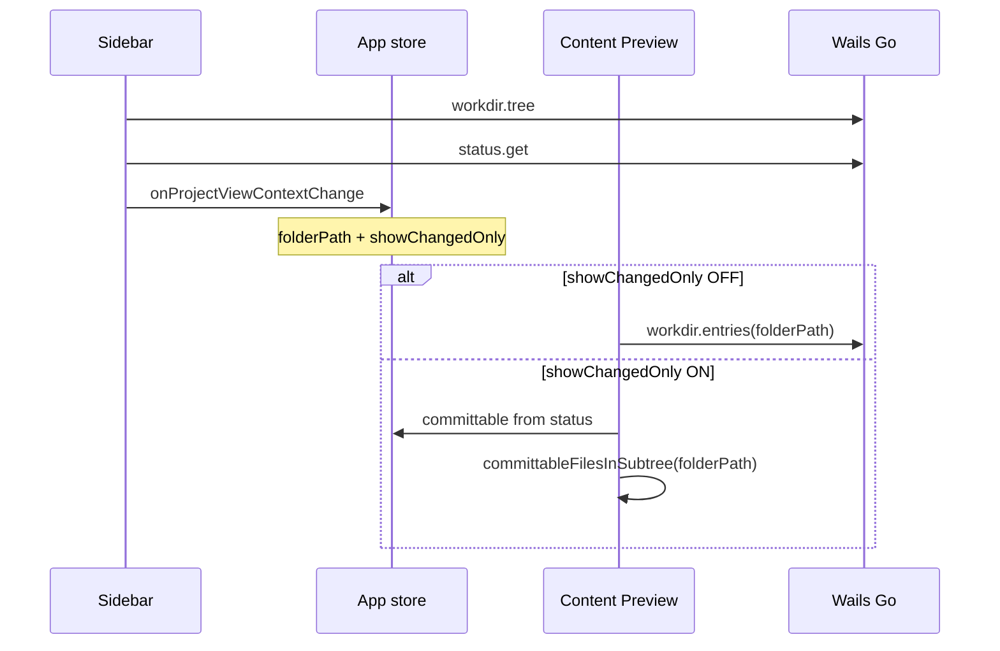

# Sidebar — Project view

Режим просмотра **структуры папок** рабочей директории репозитория.  
**Figma (shadcn kit):** [Sidebar/Files `4026:4812`](https://www.figma.com/design/Vhp8g306WGBcjSzL4lnl23/?node-id=4026-4812)

**Цвета:** [design-tokens.md](./design-tokens.md)

**Решения v1.0:** [decisions.md §5](./decisions.md) — lazy folder tree.

**Rail (общий):** [architecture.md §2.2](./architecture.md) — logo, mode icons, **Settings**, avatar. Figma: [`4026:4812`](https://www.figma.com/design/Vhp8g306WGBcjSzL4lnl23/?node-id=4026-4812).

---

## 1. Назначение

Sidebar показывает **только папки** в виде **полностью раскрытого дерева**. Файлы в Sidebar **не отображаются** — их список и просмотр в **Content Preview** (отдельная панель).

| Зона | Что показывает |
|------|----------------|
| **Sidebar (Project view)** | Дерево папок + count badge |
| **Content Preview** | Файлы выбранной папки, preview, diff |

Выбор папки или **All files** в Sidebar → обновляет `selectedFolderPath` в project store и эмитит `onProjectViewContextChange` (см. [api-contract.md §6](./api-contract.md)).

Toggle **Changed** — **только в Content Preview** ([content-preview-project-view.md §2.1](./content-preview-project-view.md), [§8](./content-preview-project-view.md)). Sidebar **реагирует** на `showChangedOnly` (фильтр дерева), но **не рендерит** Switch.

| `selectedFolderPath` | Значение |
|----------------------|----------|
| `'*'` | **All files** — все файлы репозитория (рекурсивно), как в Anchorpoint Edge |
| `''` | *(не используется в UI v1.1+)* — зарезервировано для API |
| `'assets/…'` | Конкретная папка — immediate children в Preview |

При `showChangedOnly = true` Sidebar дополнительно фильтрует дерево папок (§3).

---

## 2. Анатомия UI

```
┌─────────────────────────────────────┐
│ Project view              [⊟]       │  ← collapse в header (Figma 4096:4593)
├─────────────────────────────────────┤
│ [📁] Project name            [⇕]    │
│ ⎇ main                              │
├─────────────────────────────────────┤
│ FOLDERS                        [⤢]  │
│ [📁] All files                972   │
│ ▼ [📁] assets                 120   │
│     ▼ [📁] References         972   │
│         [📁] chars             12   │
│     [📁] Textures              56   │
│         (scroll)                    │
└─────────────────────────────────────┘
```

**Figma (полный экран «All files»):** [4090:4628](https://www.figma.com/design/Vhp8g306WGBcjSzL4lnl23/?node-id=4090-4628)

### 2.1 Header

| Элемент | Поведение |
|---------|-----------|
| Title `Project view` | Статичный label (`text-base/semibold`) |
| **Collapse** | `Button` ghost 28×28, `PanelLeft` 16 — **справа** в строке title; сворачивает Sidebar → Rail only |
| Changed toggle | **Не в Sidebar** — см. [content-preview-project-view.md §2.1](./content-preview-project-view.md) |

Figma [4026:4812](https://www.figma.com/design/Vhp8g306WGBcjSzL4lnl23/?node-id=4026-4812): header row `4026:4823` — title + collapse (`4096:4593`).

### 2.2 Repo selector

Спека multi-repo: [multi-repo.md](./multi-repo.md).

- Иконка `FolderGit2`, текст = `basename(repoPath)`.
- **Dropdown:** канон [design-tokens.md §4.5](./design-tokens.md) — кастомный trigger + panel (как `DropdownSelector`); **не** нативный `<select>`.
- Список из `[repo]` в `setup.cfg` ([paths.md §2](./paths.md)); галочка `Check` у текущего.
- **+ Add repository…** — native folder picker; если нет `.DFM` → [init-repository-dialog.md](./init-repository-dialog.md); иначе добавить в `[repo]` (`path_N`) и открыть.
- Фон: `bg-background` (white) + border.
- При запуске: авто-open из `[current repo] path` (см. [multi-repo.md §3](./multi-repo.md)).

**Текущая ветка (read-only):** под repo selector — `GitBranch` + `currentBranch` (`text-xs text-muted-foreground`). Checkout только из History `BranchSelector` ([sidebar-history-view.md §2.6](./sidebar-history-view.md)); в Project mode ветка не переключается.

### 2.3 Секция Folders — заголовок и expand/collapse

| Элемент | Spec |
|---------|------|
| Label | `Folders` — `text-xs font-semibold uppercase text-muted-foreground` ([design-tokens.md §3.1](./design-tokens.md)) |
| **Toggle button** | Один `Button ghost` 32×32, icon 16×16 — **замена** двум кнопкам «Expand all» / «Collapse» |
| Icon collapsed | `Expand` (lucide) — дерево свёрнуто до top-level |
| Icon expanded | `Shrink` (lucide) — хотя бы один узел раскрыт |
| Click collapsed | `expandAllFolders()` — загрузить полное дерево (с лимитом `EXPAND_ALL_FILE_LIMIT`) |
| Click expanded | `collapseAllFolders()` — свернуть все узлы, оставить top-level + **All files** |
| Disabled | `treeLoading` или `folderTree.item_count >= EXPAND_ALL_FILE_LIMIT` (только для expand) |
| Tooltip | `Expand all folders` / `Collapse all folders` |

Figma: кнопка `4089:3646` в [4026:4812](https://www.figma.com/design/Vhp8g306WGBcjSzL4lnl23/?node-id=4026-4812).

### 2.4 All files (виртуальный пункт)

Первый row в scroll-области, **над** деревом папок. UX как **Anchorpoint Edge** — flat-просмотр всех файлов репозитория.

| Property | Spec |
|----------|------|
| Label | `All files` (i18n `sidebar.allFiles`) |
| Icon | `Folder` 16×16 |
| Selection value | `selectedFolderPath = '*'` |
| Count badge | **OFF Changed:** `folderTree.item_count` (recursive files, весь репо). **ON Changed:** число committable файлов |
| Row style | Канон [design-tokens.md §4](./design-tokens.md) — Default / Hover / Selected (`bg-accent`) |
| Default on open | **All files** выбран при первом открытии репо (если нет сохранённого per-repo pref) |
| Changed filter | Строка **всегда видна**; при ON без committable — count `0`, Preview empty |

**Content Preview при `'*'`:** см. [content-preview-project-view.md §1.2](./content-preview-project-view.md) — заголовок `All files <repoName>`, секция **Folders скрыта**, flat grid **всех** файлов репо (не только immediate). Поиск и drill-down по подпапкам в Preview по-прежнему синхронизируют `selectedFolderPath` на конкретную папку.

Figma: row `4090:4185` (Selected) в [4026:4812](https://www.figma.com/design/Vhp8g306WGBcjSzL4lnl23/?node-id=4026-4812); экран [4090:4628](https://www.figma.com/design/Vhp8g306WGBcjSzL4lnl23/?node-id=4090-4628).

### 2.5 Дерево папок

**Канон:** [decisions.md §5](./decisions.md) · API: [api-contract.md §4.1](./api-contract.md).

**Решения:**

| # | Поведение |
|---|-----------|
| Содержимое | **Только папки**, файлы не рендерятся |
| Layout | **Tree**, не drill-down |
| Раскрытие | **Lazy expand** per-node (chevron) + **global toggle** в заголовке §2.3 |
| Repo root row | **Удалён** — заменён пунктом **All files** §2.4 |

#### Lazy expand

- Первый запрос: `workdir.tree({ path: '', depth: 1 })`.
- Клик chevron на узле без загруженных детей → `workdir.tree({ path: '<node>', depth: 1 })` → merge в локальное дерево.
- Chevron **активен** (rotate on expand/collapse локального узла).
- Global toggle §2.3: expand all → `depth: -1` (или полный обход); collapse → сброс `expandedPaths`.

#### Визуал строки папки

- Отступ по глубине (`paddingLeft = depth * indent`).
- Chevron `ChevronRight` / `ChevronDown` — expand/collapse узла (v1.0 lazy).
- Icon `Folder`.
- Name (`text-sm/medium`, `foreground/secondary`).
- Count badge справа (`text-xs/semibold`).
- **Default:** прозрачный фон на белом Container.
- **Hover / Selected:** канон [design-tokens.md §4](./design-tokens.md) — `treeRowStateClasses` (`bg-accent` only; **без** border).

#### Клик по папке / All files

- Highlight row (`selected`).
- `path: '*'` — **All files**; Preview — flat grid всех файлов репо (§2.4).
- `path: 'assets/References'` — Preview показывает immediate subfolders + files этой папки.
- Emit `onProjectViewContextChange` (§3.3) при каждом изменении selection или toggle.

#### Папки без файлов (только подпапки)

- Показываются в дереве как обычно.
- `item_count` может быть > 0 (recursive **файлы** в поддереве; папки не считаются).
- Клик → Preview: empty state «No files in this folder» (только подпапки есть).

#### Сворачивание (collapse)

- Per-node: chevron toggle.
- Global: один toggle в заголовке §2.3 (expand ↔ collapse all).
- Persist `expandedPaths` в `localStorage` per repo ([architecture.md §3.2](./architecture.md)).

#### Производительность

- v1.0: lazy `workdir.tree` — не грузить всё дерево сразу.
- v1.1: `@tanstack/react-virtual` на flat list при fully expanded ([decisions.md §3](./decisions.md)).
- Skeleton при первой загрузке уровня.

**Layout:** scroll-область дерева — `bg-background`, **без** собственного `border-r`; правая граница Sidebar — один раз на shell-колонке ([architecture.md §2.5](./architecture.md)).

### 2.6 Цвета (List Container)

См. [design-tokens.md §3.1](./design-tokens.md).

| Элемент | Figma token | Tailwind |
|---------|-------------|----------|
| Shell Sidebar | `background/primary/light` | `bg-sidebar` |
| List Container | `background/default` | `bg-background` |
| Repo selector | `background/default` | `bg-background border-border` |
| Folder row Default | — | transparent |
| Folder row Hover / Selected | см. [design-tokens.md §4](./design-tokens.md) | `treeRowStateClasses` |

---

## 3. Режим «Changed» — эффект на Sidebar (toggle в Preview)

Toggle UI живёт в **Content Preview** ([content-preview-project-view.md §8](./content-preview-project-view.md)). При `showChangedOnly = true` Sidebar **дополнительно** фильтрует дерево; Preview — committable-only (§3.3 в content-preview).

### 3.1 Sidebar: фильтр дерева папок

Показывать только папки, в поддереве которых есть хотя бы один **committable** файл (§3.2):

- Родительские папки сохраняются (prune пустых веток).
- Дерево может быть свёрнуто global toggle; при ON auto-expand веток с committable — backlog v2.1+.
- Badge (опционально v1.1): число committable файлов в поддереве.

**Switch OFF:** полное дерево всех папок.

### 3.2 Committable files (источник для фильтра)

Объединение всех массивов из `status.get` — файлы, которые можно включить в коммит (находятся в index и/или working tree с изменениями):

| Категория | Поле `status.get` | В Changed |
|-----------|-------------------|-----------|
| Staged new | `staged_new_files` | ✓ |
| Staged modified | `staged_modified_files` | ✓ |
| Staged deleted | `staged_deleted_files` | ✓ |
| Unstaged modified | `unstaged_modified_files` | ✓ |
| Unstaged deleted | `unstaged_deleted_files` | ✓ |
| Untracked | `untracked_files` | ✓ |
| Clean (tracked, без изменений) | — | ✗ |

```ts
function committablePaths(status: Status): string[] {
  return unique([
    ...status.staged_new_files,
    ...status.staged_modified_files,
    ...status.staged_deleted_files,
    ...status.unstaged_modified_files,
    ...status.unstaged_deleted_files,
    ...status.untracked_files,
  ])
}
```

### 3.2 Content Preview (ссылка)

Поведение Preview при Changed ON — [content-preview-project-view.md §8](./content-preview-project-view.md). Сигнал `showChangedOnly` в `onProjectViewContextChange` выставляет **Preview toolbar**, не Sidebar.

```ts
interface ProjectViewContext {
  selectedFolderPath: string   // '*' = All files; folder rel path otherwise
  showChangedOnly: boolean     // источник UI: Content Preview toolbar
}

// App-level event — эмит при смене folder (Sidebar/Preview) или showChangedOnly (Preview)
onProjectViewContextChange(ctx: ProjectViewContext): void
```

**Preview поведение** (кратко):

| `showChangedOnly` | Файлы в Preview для `selectedFolderPath` |
|-------------------|------------------------------------------|
| `false` + `'*'` | **Все files** репозитория (flat, `workdir.entries_by_paths` или recursive API) |
| `false` + folder | Immediate files в папке (`workdir.entries`) |
| `true` + `'*'` | Все **committable** files репозитория (flat) |
| `true` + folder | Все **committable** files **рекурсивно** в поддереве папки |

Фильтр Preview при `showChangedOnly = true`:

```ts
function committableFilesInSubtree(
  folderPath: string,
  committable: string[],
): string[] {
  if (folderPath === '') {
    return [...committable]
  }
  const prefix = folderPath + '/'
  return committable.filter((filePath) => filePath.startsWith(prefix))
}
```

- **All files (`'*'`):** flat-список всех committable файлов репозитория — удобно для multiselect и **Create commit**.
- **Подпапка:** только committable внутри этой папки и вложенных подпапок.
- Сортировка: см. [content-preview-project-view.md §6](./content-preview-project-view.md) — по умолчанию name-sort по **полному относительному path** (не только basename).
- В карточке файла: subtitle = parent folder (`assets` / `root`) для различения одноимённых имён.
- Секция **Folders** в Preview скрыта; навигация по scope — через дерево Sidebar или breadcrumbs.

Каждый файл в Preview сопровождается `VcsFileStatus` из `status.get` (badge `M`, `A`, `D`, `N`).

**При включении Changed без выбранной папки:** сохранить текущий `selectedFolderPath`; если null, default **All files** (`'*'`).

### 3.4 Алгоритм фильтра дерева (Sidebar)

```ts
function folderPathsWithChanges(committable: string[]): Set<string> {
  const folderPaths = new Set<string>()
  for (const file of committable) {
    let dir = dirname(file)
    while (dir && dir !== '.' && dir !== '') {
      folderPaths.add(dir)
      dir = dirname(dir)
    }
    if (!file.includes('/')) {
      folderPaths.add('') // root has committable files
    }
  }
  return folderPaths
}

function pruneTree(node: FolderNode, changedFolders: Set<string>): FolderNode | null {
  if (!changedFolders.has(node.path) && !hasDescendantInSet(node, changedFolders))
    return null
  // keep node, recurse children
}
```

---

## 4. Data flow



---

## 5. Corner cases

| Ситуация | Поведение |
|----------|-----------|
| Нет папок (только файлы в root) | Дерево пустое; **All files** выбран; Preview — flat grid всех файлов |
| Changed ON, All files | Preview — все committable репо (flat) |
| Changed ON, нет изменений | Empty tree «No changed folders»; Preview «No changed files» |
| Пустая папка в дереве | Показать узел, count `0`, лист без детей |
| `.DFM/` | Не включается в дерево |
| `.dfmignore` (файл) | **Не показывать** в GUI (ни в дереве, ни в Preview, ни в поиске) — [api-contract.md §4.0](./api-contract.md) |
| Пути из `.dfmignore` | Игнорируемые папки/файлы не строятся |
| Папка удалена на диске | Refresh → узел исчезает; сброс selection если была выбрана |
| Очень глубокое дерево | Virtual scroll |
| Toggle Changed при выбранной папке | Preview перефильтровывает без сброса folder |
| Переключение репо | Перезагрузка tree; selection → **All files** (`'*'`) или restore per-repo pref; `[current repo]` в setup.cfg ([multi-repo.md](./multi-repo.md)) |
| Unicode / длинные имена | truncate + tooltip |

---

## 6. Компоненты (React)

| Component | Notes |
|-----------|-------|
| `ProjectViewPanel` | Container |
| `ProjectHeader` | Title only (no Changed switch) |
| `RepoSelector` | `DropdownSelector` pattern + Add repository footer — [design-tokens.md §4.5](./design-tokens.md) |
| `AllFilesRow` | Virtual «All files» entry; `selectedFolderPath === '*'` |
| `FolderTreeExpandToggle` | Single expand/collapse button in Folders header |
| `FolderTree` | Virtualized flat list from expanded tree |
| `FolderTreeRow` | indent, icon, name, count, selected |

**Удалено из scope:** `FolderList` (drill-down), `ChangedFileList`, `ChangedFileListItem`.

---

## 7. Backend API

### 7.1 `workdir.tree`

JSON API: [api-contract.md §4.1](./api-contract.md).

```go
type FolderTreeNode struct {
    Name      string           `json:"name"`
    Path      string           `json:"path"`
    ItemCount int              `json:"item_count"` // recursive file count
    Children  []FolderTreeNode `json:"children"`
}
```

- Корень: synthetic node `path: ""`, `name` = repo basename или `"."`.
- **Только директории** в `children`; файлы не возвращаются.
- `item_count` — recursive **file count**. Семантика: [architecture.md §4.2](./architecture.md).
- Exclude `.DFM`, файл `.dfmignore`, паттерны `.dfmignore`, no symlink follow — [api-contract.md §4.0](./api-contract.md).

### 7.2 Preview entries

`workdir.entries(repoPath, folderRel)` — immediate children (folders + files) для Content Preview. См. [api-contract.md §4.2](./api-contract.md).

---

## 8. Решения

| # | Тема | Решение |
|---|------|---------|
| 1 | Count badge | **Recursive files** — [architecture.md §4.2](./architecture.md) |
| 2 | Навигация | Lazy tree + **один** expand/collapse toggle в заголовке Folders |
| 3 | **All files** | Виртуальный пункт `'*'` — flat grid всех файлов (Edge-style) |
| 4 | Файлы в Sidebar | **Нет** — только в Content Preview |
| 5 | Drill-down | **Отменён** (только в Preview) |
| 6 | Changed toggle | **Content Preview toolbar**; Sidebar только фильтрует дерево при ON (§3) |
| 7 | Repo root row | **Удалён** — заменён **All files** |
| 8 | Collapse узлов | Per-node chevron + global toggle §2.3 |
| 9 | Multi-repo | [multi-repo.md](./multi-repo.md) — `~/.dfm/setup.cfg` `[current repo]` + `[repo]` |
